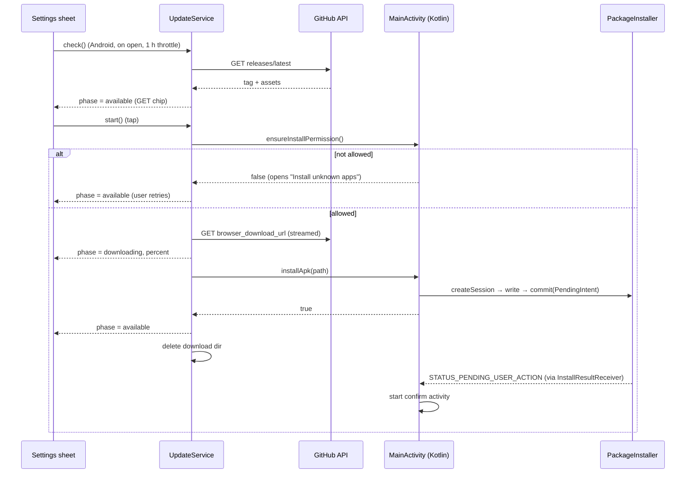

# Android Self-Update

The Android build checks GitHub Releases for a newer APK and installs it on user confirmation. It is wired into the Settings sheet's version row. Off Android it does nothing.

## Components

| Piece | File | Role |
|---|---|---|
| `UpdateService` | `lib/services/update_service.dart` | Release check, download, state (`UpdatePhase`), cleanup |
| Version row chip | `lib/widgets/void_settings_sheet.dart` (`updateChip`) | `GET <version>` → `<percent>%` → `...` |
| Channel wrappers | `lib/services/platform_channels.dart` | `ensureInstallPermission`, `installApk` |
| `MainActivity` cases | `android/.../MainActivity.kt` | Permission check/intent, PackageInstaller session commit |
| `InstallResultReceiver` | `android/.../InstallResultReceiver.kt` | Shows the system confirm prompt; logs other statuses |

## Flow

The chip returns to `available` as soon as the commit is accepted. The user then confirms in the system dialog. The app process is replaced on success.

## Version and asset rules

- Release tag: `v<semver>+<build>`, for example `v3.14.14+82`.
- The build number is compared as an int against `PackageInfo.buildNumber` (the Android `versionCode`).
- The APK is the asset named `nothingness-android-*.apk`. Its `browser_download_url` is used verbatim (it contains `%2B`).
- No checksum check. HTTPS plus Android's signature-continuity check on update is the integrity boundary.

## No APK left on the device

- The download goes to `<cacheDir>/update/update.apk`. The name is fixed, so at most one file can exist.
- The file is deleted in `finally`, once the commit returns or the attempt fails.
- `sweep()` runs at launch. It abandons installer sessions and removes the directory, which covers a process killed mid-attempt.
- Each PackageInstaller session keeps a staged copy of the APK. Abandoning a session erases that copy. Sessions are also abandoned before each new commit.
- `sweep()` is not called after an attempt. A committed session may still be waiting for the user's confirmation.

## Install constraints

- `REQUEST_INSTALL_PACKAGES` is declared. Per-app "Install unknown apps" must be enabled by the user. The permission check runs before the download, so no bytes are fetched that cannot be installed.
- Installs use the default user-action-required mode. `USER_ACTION_NOT_REQUIRED` is not used: it is best-effort, and it would kill the process mid-playback without a prompt.
- Signature continuity: a local build signed with the debug key (no `android/key.properties`) cannot update a release install. CI and the local `key.properties` keystore produce the same certificate (SHA-256 `3bc8a61a…`).
- Confirm launches from the receiver need MainActivity to be visible. If the app is backgrounded between commit and callback, the prompt is blocked and the session idles until the next attempt.

## Outside the app's control

- Google Play forbids self-updating outside Play and restricts `REQUEST_INSTALL_PACKAGES`. This is a GitHub-only build; a Play build would need the permission removed.
- Android developer verification began 2026-09-30 for installs through participating stores in Brazil, Indonesia, Singapore and Thailand. Sideloaded APKs are not covered yet; Google plans worldwide enforcement in 2027. Blocked installs would arrive as `STATUS_FAILURE_BLOCKED` in the receiver.

## Testing

- Unit: `test/services/update_service_test.dart` covers release parsing, the throttle, failure handling, the download → commit → cleanup order (Android gate flipped, channels mocked), and sweep.
- Widget: `test/widgets/void_settings_sheet_test.dart` covers chip visibility and the three visible states.
- Device: install an older build (`flutter build apk --release --build-number=80`), then update to the latest release from the Settings chip.
