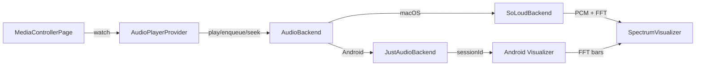
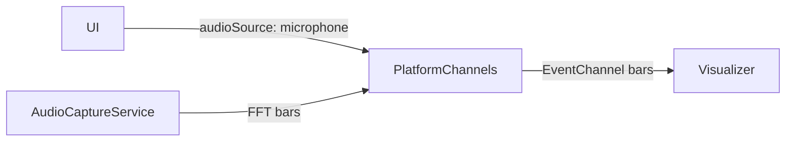

# Audio Playback & Spectrum Architecture

This document details audio stack choices, data paths, and behaviors for playback-driven and microphone-driven spectrum visualization. It complements the high-level overview.

## Goals & Rationale
- Platform-specific backends behind one interface: SoLoud on macOS; just_audio + audio_service on Android.
- Spectrum comes from the active backend (SoLoud FFT on macOS, Android visualizer tied to player session) with microphone capture as an Android fallback.
- Preserve quick switching between backend spectrum and microphone source based on `SpectrumSettings.audioSource`.

## Core Components
- **`AudioPlayerProvider`**: `ChangeNotifier` that wraps an `AudioBackend` and surfaces state (song info, playing, queue, shuffle, spectrum data) without prop drilling.
- **`AudioBackend` implementations**:
  - **`SoLoudBackend` (macOS)**: SoLoud playback, queue/load/play/pause/seek, SoLoud FFT for spectrum.
  - **`JustAudioBackend` (Android)**: just_audio playback + audio_service/just_audio_background for media session, notification, headset/lock-screen controls; spectrum via Android visualizer bound to the player session. Android package is arm64-only and excludes SoLoud native libs.
- **`SpectrumProvider` interface**: Strategy for sourcing FFT bars.
  - **Backend spectrum**: SoLoud FFT (macOS) or Android visualizer stream.
  - **`MicrophoneSpectrumProvider`** (Android fallback): Streams FFT bars from native `AudioCaptureService` via EventChannel; requires mic permission.
- **`MediaControllerPage`**: Uses Provider for player state; switches capture based on `SpectrumSettings.audioSource` (backend spectrum by default, mic when explicitly selected on Android).

## Playback Pipeline (Backend Spectrum)

### Lifecycle Notes
- Backends initialize at bootstrap via `AudioPlayerProvider.init()`; macOS enables SoLoud visualization, Android binds to the player session for visualizer once sources are set.
- On play: backend stops prior playback/source, loads, plays, and (re)starts spectrum capture (SoLoud FFT or Android visualizer subscription).
- On pause: pause playback and stop spectrum capture to reduce CPU; resume restarts capture. Skip-on-error handling remains in the backends.
- On completion: just_audio handles auto-advance in Android; SoLoud backend checks position/duration and advances or stops.

## Microphone Pipeline (Android Only, fallback)

### Lifecycle Notes
- Requires notification/audio capture permissions.
- Switching to mic mode stops backend spectrum and subscribes to the native mic stream.
- Switching back to backend mode re-enables backend spectrum (SoLoud FFT or Android visualizer).

## Settings Impact
- `SpectrumSettings.audioSource`: toggles backend spectrum (default) vs mic provider (Android-only fallback).
- `SpectrumSettings.barCount`, `decaySpeed`, `noiseGateDb`: applied in spectrum providers; decay also maps to backend FFT/visualizer smoothing when supported.
- Settings load after backend init to avoid init races and are pushed to providers and native side as needed.

## Playlist Management
- Queue state (tracks, play order, current index, shuffle flag) is persisted with Hive via `PlaylistStore`, sized to handle thousands of tracks efficiently.
- The "Now Playing" tab renders the active play order; tapping shuffle reshuffles and keeps the current track first, and reset order restores sequential playback.
- Auto-advance uses the persisted play order; when the queue ends playback stops cleanly while keeping the queue available on next launch.

## Error Handling & Guardrails
- SoLoud init is awaited before visualization calls; UI bootstrap was sequenced to remove `SoLoudNotInitializedException` risk.
- Playback load/play is wrapped in `runZonedGuarded`; failures skip to the next track until a playable file is found.
- **Android Error Recovery**: `JustAudioBackend` detects when the player gets stuck in an idle state or encounters source errors (e.g., `FileNotFoundException`). It automatically marks the track as `isNotFound` (triggering UI updates via `errorStateNotifier`) and skips to the next track.
- Spectrum polling checks for a valid handle and skips if absent.
- Source disposal happens before new loads to prevent leaked handles.
- Mic pipeline activates only when permission is granted; otherwise bars fall back to zeros.

## Known Limitations / Future Work
- macOS: spectrum is player-only; no microphone capture path.
- SoLoud visualization must remain enabled; providers re-enable on start if needed.
- Android package is arm64-only; adding more ABIs would increase APK size.
- Consider graceful backoff/logging when native mic stream stalls.
- Possible enhancement: normalize FFT window size to match bar count more tightly.

## References
- High-level overview: [overview.md](overview.md)
- UI scaling details: [ui-scaling.md](ui-scaling.md)
- Skins/layouts: [skins.md](skins.md)
