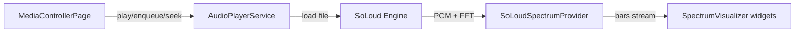
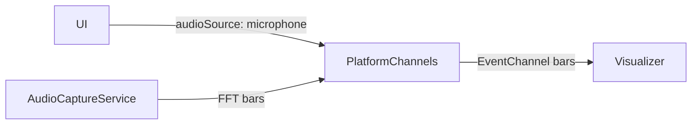

# Audio Playback & Spectrum Architecture

This document details audio stack choices, data paths, and behaviors for playback-driven and microphone-driven spectrum visualization. It complements the high-level overview.

## Goals & Rationale
- Cross-platform (Android + macOS) spectrum from player output without macOS-native capture.
- Keep Android microphone capture for ambient mode.
- Center playback and FFT on `flutter_soloud` (single engine).
- Swap quickly between player and microphone sources based on `SpectrumSettings.audioSource`.

## Core Components
- **`AudioPlayerService`**: Initializes SoLoud once, enables visualization, manages queue/load/play/pause/seek, emits `SongInfo`, and disposes prior sources.
- **`SpectrumProvider` interface**: Strategy for sourcing FFT bars.
  - **`SoLoudSpectrumProvider`**: Polls SoLoud `AudioData` (linear) for the current handle; applies noise gate and decay smoothing from `SpectrumSettings`.
  - **`MicrophoneSpectrumProvider`** (Android-only): Streams FFT bars from the native `AudioCaptureService` via platform channels; requires mic permission.
- **`MediaControllerPage`**: Waits for player init before applying spectrum settings and wires the provider per `SpectrumSettings`.

## Playback Pipeline (Player Mode)

### Lifecycle Notes
- SoLoud initializes at bootstrap; visualization is enabled immediately.
- On play: stop prior handle, dispose prior source, load file, play, start spectrum polling.
- On pause: pause playback and stop spectrum polling to reduce CPU; resume restarts polling.
- On completion: position check triggers `next()` when position >= duration.

## Microphone Pipeline (Android Only)

### Lifecycle Notes
- Requires notification/audio capture permissions.
- Switching to mic mode stops SoLoud polling and subscribes to the native stream.
- Switching back to player mode re-enables SoLoud polling.

## Settings Impact
- `SpectrumSettings.audioSource`: toggles player vs mic provider.
- `SpectrumSettings.barCount`, `decaySpeed`, `noiseGateDb`: applied in providers; decay also maps to SoLoud FFT smoothing.
- Settings load after player init to avoid SoLoud init errors and are pushed to providers and native mic side.

## Error Handling & Guardrails
- SoLoud init is awaited before visualization calls; UI bootstrap was sequenced to remove `SoLoudNotInitializedException` risk.
- Spectrum polling checks for a valid handle and skips if absent.
- Source disposal happens before new loads to prevent leaked handles.
- Mic pipeline activates only when permission is granted; otherwise bars fall back to zeros.

## Known Limitations / Future Work
- macOS: spectrum is player-only; no microphone capture path.
- SoLoud visualization must remain enabled; providers re-enable on start if needed.
- Consider graceful backoff/logging when native mic stream stalls.
- Possible enhancement: normalize FFT window size to match bar count more tightly.

## References
- High-level overview: [overview.md](overview.md)
- UI scaling details: [ui-scaling.md](ui-scaling.md)
- Skins/layouts: [skins.md](skins.md)
