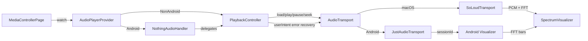
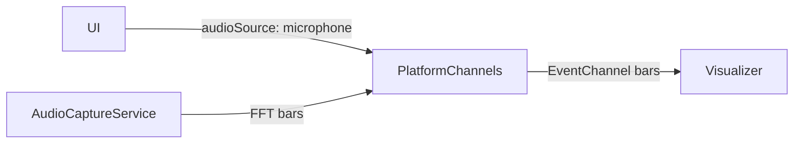

# Audio Playback & Spectrum Architecture

This document details audio stack choices, data paths, and behaviors for playback-driven and microphone-driven spectrum visualization. It complements the high-level overview.

## Goals & Rationale
- Clean separation of concerns: `PlaybackController` handles business logic (user intent, queue, error recovery), `AudioTransport` provides thin native player control.
- Platform-specific transports behind one interface: SoLoud on macOS; just_audio on Android. On Android, `NothingAudioHandler` (audio_service) owns MediaSession/notification state and delegates playback logic to `PlaybackController`.
- Spectrum comes from the active transport (SoLoud FFT on macOS, Android visualizer tied to player session) with microphone capture as an Android fallback.
- Preserve quick switching between transport spectrum and microphone source based on `SpectrumSettings.audioSource`.
- User intent tracking via `PlayIntent` enum prevents race conditions between pause and auto-skip.

## Core Components
- **`AudioPlayerProvider`**: `ChangeNotifier` that wraps a `PlaybackController` and surfaces state (song info, playing, queue, shuffle, spectrum data) without prop drilling.
- **`NothingAudioHandler` (Android)**: `audio_service` handler that owns MediaSession/notification state. It mirrors queue/media item/playback state for the OS and delegates playback decisions to `PlaybackController`.
- **`PlaybackController`**: Single source of truth for playback logic. Responsibilities include:
  - **User intent tracking**: Maintains `PlayIntent` enum (play/pause) to represent explicit user intent, preventing race conditions between pause and auto-skip.
  - **Queue management**: Owns `PlaylistStore` instance, manages track ordering, shuffle state, and current index.
  - **Deterministic missing-file handling**: Centralized in a bounded scan loop (`_playWithAutoAdvance`) so missing/known-failed tracks are always marked red and skipped consistently across tap/Next/Previous/natural advance.
  - **`isNotFound` tracking**: Backend-agnostic tracking of failed track paths (moved from platform-specific implementations).
  - **SongInfo emission**: Consolidates song info updates from transport position/duration.
- **`AudioTransport` (interface)**: Thin abstraction over platform-specific players. Provides minimal interface:
  - Load audio files (`load(String path)`)
  - Play/pause/seek control
  - Position and duration queries
  - Event emission (`TransportEvent`: error, ended, loaded, position)
  - Spectrum stream (optional)
  - Does NOT handle: queue management, skip logic, user intent tracking
- **`AudioTransport` implementations**:
  - **`SoLoudTransport` (macOS)**: Thin wrapper around SoLoud for playback and FFT. No queue awareness, no skip logic.
  - **`JustAudioTransport` (Android)**: Thin wrapper around just_audio for playback control and position/duration/events. Spectrum via Android visualizer bound to the player session. No queue management; no `maxSkipsOnError` - all skipping handled by `PlaybackController`. Android package is arm64-only and excludes SoLoud native libs.
- **`SpectrumProvider` interface**: Strategy for sourcing FFT bars.
  - **Transport spectrum**: SoLoud FFT (macOS) or Android visualizer stream.
  - **`MicrophoneSpectrumProvider`** (Android fallback): Streams FFT bars from native `AudioCaptureService` via EventChannel; requires mic permission.
- **`MediaControllerPage`**: Uses Provider for player state; switches capture based on `SpectrumSettings.audioSource` (transport spectrum by default, mic when explicitly selected on Android).

## Playback Pipeline (Transport Spectrum)

### Lifecycle Notes
- Transports and controller initialize at bootstrap via `AudioPlayerProvider.init()` → `PlaybackController.init()` → `AudioTransport.init()`; macOS enables SoLoud visualization, Android binds to the player session for visualizer once sources are set.
- On play: `PlaybackController` sets `userIntent = PlayIntent.play`, transport stops prior playback/source, loads, plays, and (re)starts spectrum capture (SoLoud FFT or Android visualizer subscription).
- On pause: `PlaybackController` sets `userIntent = PlayIntent.pause`, transport pauses playback and stops spectrum capture to reduce CPU; resume restarts capture. Error recovery respects `userIntent` - if paused, errors don't trigger auto-skip.
- On completion: Transport emits `TransportEndedEvent`; `PlaybackController` checks `userIntent` and advances to next track if `userIntent == play`, otherwise stops.
- On error / missing file: missing/known-failed tracks are marked `isNotFound` and skipped consistently across tap/Next/Previous/natural advance. `TransportErrorEvent` is used to mark pending-load failures safely (no second skip chain); the `load()` catch path drives the skip. Optional preflight: `PlaybackController(preflightFileExists: true)` (default) checks `File(path).exists()` for filesystem paths and skips immediately if missing (skips `content://` URIs).

## Microphone Pipeline (Android Only, fallback)

### Lifecycle Notes
- Requires notification/audio capture permissions.
- Switching to mic mode stops transport spectrum and subscribes to the native mic stream.
- Switching back to transport mode re-enables transport spectrum (SoLoud FFT or Android visualizer).

## Settings Impact
- `SpectrumSettings.audioSource`: toggles transport spectrum (default) vs mic provider (Android-only fallback).
- `SpectrumSettings.barCount`, `decaySpeed`, `noiseGateDb`: applied in spectrum providers; decay also maps to transport FFT/visualizer smoothing when supported.
- Settings load after transport/controller init to avoid init races and are pushed to transports and native side as needed.

## Playlist Management
- Queue state (tracks, play order, current index, shuffle flag) is persisted with Hive via `PlaylistStore`, sized to handle thousands of tracks efficiently.
- The "Now Playing" tab renders the active play order; tapping shuffle reshuffles and keeps the current track first, and reset order restores sequential playback.
- Auto-advance uses the persisted play order; when the queue ends playback stops cleanly while keeping the queue available on next launch.

## Error Handling & Guardrails
- SoLoud init is awaited before visualization calls; UI bootstrap was sequenced to remove `SoLoudNotInitializedException` risk.
- **Missing files / failed tracks (deterministic)**:
  - Missing-file behavior is centralized in a bounded scan loop (`_playWithAutoAdvance`).
  - Invariants:
    - Tap missing track: mark red (`isNotFound`) and continue to the next playable track.
    - Next/Previous/natural end: missing/known-failed tracks are skipped automatically.
    - Known-failed + user tap retries once (so “file restored” can clear red and play).
  - Optional preflight: `preflightFileExists` (default true) checks filesystem paths before calling `load()`.
- **Error event handling (safe attribution)**:
  - `TransportErrorEvent` is only used to mark the pending-load track as failed; it does not start an additional skip chain.
  - The `load()` catch path is responsible for advancing, preventing double-advance races.
- Spectrum polling checks for a valid handle and skips if absent.
- Source disposal happens before new loads to prevent leaked handles.
- Mic pipeline activates only when permission is granted; otherwise bars fall back to zeros.

## Known Limitations / Future Work
- macOS: spectrum is player-only; no microphone capture path.
- SoLoud visualization must remain enabled; providers re-enable on start if needed.
- Android package is arm64-only; adding more ABIs would increase APK size.
- Consider graceful backoff/logging when native mic stream stalls.
- Possible enhancement: normalize FFT window size to match bar count more tightly.
- Android EQ: v1 uses the platform `android.media.audiofx.Equalizer` (device-dependent).

## Android Equalizer (v1)
- **Scope**: Android-only audio effect; UI lives in Settings → GLOBAL → EQ.
- **Engine**: `android.media.audiofx.Equalizer` attached to the current `just_audio` session id.
- **UI**: Fixed 5-band graphic EQ (60 / 230 / 910 / 3.6k / 14k Hz) with per-band gain sliders.
- **Mapping**: Each UI band is mapped to the nearest device-supported Equalizer band by center frequency; if multiple UI bands map to the same device band, gains are averaged.
- **Notes**: Support varies by OEM/ROM; on unsupported devices the app should fail gracefully (EQ disabled).

## References
- High-level overview: [overview.md](overview.md)
- UI scaling details: [ui-scaling.md](ui-scaling.md)
- Skins/layouts: [skins.md](skins.md)
