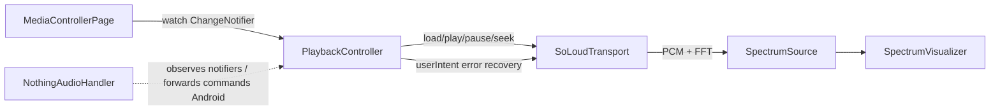
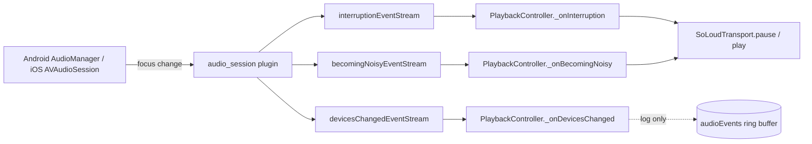
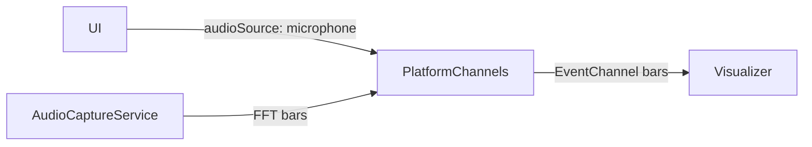

# Audio Playback & Spectrum Architecture

This document details audio stack choices, data paths, and behaviors for playback-driven and microphone-driven spectrum visualization. It complements the high-level overview.

## Goals & Rationale
- Clean separation of concerns: `PlaybackController` handles business logic (user intent, queue, error recovery, audio focus / route handling), `AudioTransport` provides thin native player control.
- Single transport: SoLoud (`flutter_soloud` 4.x) on all platforms. No backend toggle needed. `NothingAudioHandler` (audio_service) owns MediaSession/notification state and delegates playback logic to `PlaybackController`.
- Spectrum comes from SoLoud's built-in FFT, with microphone capture as an Android fallback.
- User intent tracking via `PlayIntent` enum prevents race conditions between pause and auto-skip.
- Audio focus events (`audio_session`) are handled in `PlaybackController` only — the transport stays intent-blind. Phone calls pause and auto-resume; headphones/BT disconnect (becoming noisy) pauses without auto-resume.

## Core Components
- **`PlaybackController`**: A `ChangeNotifier` and the single source of truth for playback logic. The UI watches it directly via `ChangeNotifierProvider<PlaybackController>` (no wrapping provider, no prop drilling). It exposes song info, playing state, queue, and shuffle. Responsibilities include:
  - **User intent tracking**: Maintains `PlayIntent` enum (play/pause) to represent explicit user intent, preventing race conditions between pause and auto-skip.
  - **Queue management**: Owns `PlaylistStore` instance, manages track ordering, shuffle state, and current index.
  - **Deterministic missing-file handling**: Centralized in a bounded scan loop (`_playWithAutoAdvance`) so missing/known-failed tracks are always marked red and skipped consistently across tap/Next/Previous/natural advance.
  - **`isNotFound` tracking**: Backend-agnostic tracking of failed track paths (moved from platform-specific implementations).
  - **SongInfo emission**: Consolidates song info updates from transport position/duration.
  - **Audio focus / route handling**: Subscribes to `AudioSession.interruptionEventStream`, `becomingNoisyEventStream`, and `devicesChangedEventStream`. Pauses on focus loss, auto-resumes on focus regain, and treats becoming-noisy as an explicit user pause (no auto-resume). See [Audio Focus & Interruption](#audio-focus--interruption) below.
  - **Audio-event diagnostics ring buffer**: Bounded 300-entry log of interruption / route / load / end / error events, exposed via `diagnosticsSnapshot()['audioEvents']` and `audioEvents()` for VM-service inspection.
- **`PlaybackTelemetry`**: Extracted from `PlaybackController`. Owns structured/diagnostic logging via `package:logging` (`Logger('nothingness.*')`); the controller delegates to it instead of carrying a bespoke logging service.
- **`SpectrumSource`**: Extracted from `PlaybackController`. Owns FFT/spectrum sourcing (SoLoud FFT by default, or the Android mic stream when selected) and exposes the spectrum data the UI renders.
- **`NothingAudioHandler` (Android)**: `audio_service` handler that owns MediaSession/notification state. It wraps the **same** `PlaybackController` as a pure observer + command-forwarder — it observes the controller's notifiers to mirror queue/media-item/playback state for the OS and forwards OS media-button commands (play/pause/next/previous/seek) back to the controller. No `customAction` IPC bridge.
- **`AudioTransport` (interface)**: Thin abstraction over platform-specific players. Provides minimal interface:
  - Load audio files (`load(String path)`). All formats — including **Opus** — take the same path: `SoLoudTransport` tries native `loadFile(path)` first and falls back to decoding from a MediaStore `content://` URI (`readAndroidAudioBytes` → `loadMem`) only when raw-path access fails (Android 11+ scoped storage blocks raw `File`/native access to shared storage). See `lib/services/android_audio_source.dart` and `B-049`.
  - **Opus decodes natively in `loadFile`/`loadMem`** (i.e. on `flutter_soloud`'s background `compute` isolate, like mp3) — *not* via a Dart-side `setBufferStream` + chunked `addAudioDataStream` feed on the UI isolate, which used to block frames for ~1–2 s on a multi-MB track. Stock `flutter_soloud` rejects Opus in `loadFile` (its Wav loader routes `OggS`→stb_vorbis), so this relies on a **local vendored fork** (`./soloud` via `dependency_overrides`) that wires the bundled Opus decoder into the file-load path. See `B-051` and `soloud/src/player.cpp` (`tryLoadOpusBufferStream`).
  - Play/pause/seek control
  - Position and duration queries
  - Event emission (`TransportEvent`: error, ended, loaded, position)
  - Spectrum stream (optional)
  - Does NOT handle: queue management, skip logic, user intent tracking
- **`AudioTransport` implementations**:
  - **`SoLoudTransport`**: Thin wrapper around SoLoud for playback and FFT on all platforms. No queue awareness, no skip logic.
- **Spectrum sourcing** (`SpectrumSource`): SoLoud FFT by default; on Android the mic stream from native `AudioCaptureService` is delivered via a `PlatformChannels` EventChannel when explicitly selected. Mic mode requires mic permission.
- **`MediaControllerPage` / UI**: Watches `PlaybackController` directly; switches capture based on `SpectrumSettings.audioSource` (transport spectrum by default, mic when explicitly selected on Android).

## Playback Pipeline (Transport Spectrum)

```mermaid
flowchart LR
  UI[MediaControllerPage] -->|watch ChangeNotifier| Controller[PlaybackController]
  Handler[NothingAudioHandler] -.->|observes notifiers / forwards commands Android| Controller
  Controller -->|load/play/pause/seek| Transport[SoLoudTransport]
  Transport -->|PCM + FFT| Spectrum[SpectrumSource]
  Spectrum --> Vis[SpectrumVisualizer]
  Controller -->|userIntent error recovery| Transport
```

### Lifecycle Notes
- Transports and controller initialize at bootstrap via `PlaybackController.init()` → `AudioTransport.init()`; SoLoud visualization is enabled on all platforms once sources are set.
- On play: `PlaybackController` sets `userIntent = PlayIntent.play`, transport stops prior playback/source, loads, plays, and (re)starts spectrum capture (SoLoud FFT).
- On pause: `PlaybackController` sets `userIntent = PlayIntent.pause`, transport pauses playback and stops spectrum capture to reduce CPU; resume restarts capture. Error recovery respects `userIntent` - if paused, errors don't trigger auto-skip.
- On completion: Transport emits `TransportEndedEvent`; `PlaybackController` checks `userIntent` and advances to next track if `userIntent == play`, otherwise stops.
- On error / missing file: the transport's `load()` is the **single source of truth** for a missing/unreadable track — when it fails, the track is marked `isNotFound` and skipped, consistently across tap/Next/Previous/natural advance (the `load()` catch path drives the skip; `TransportErrorEvent` marks the pending-load failure safely, no second skip chain). A transient load error retries; a definitive one marks not-found. There is **no** `File.exists()` preflight (removed in 3.7.0 — it false-negatived on Android scoped storage, where the playable source is a content URI, not the raw path).
- Song info (title/artist) is emitted **synchronously** from the playback state's track the instant a command lands, so the hero name cycles at 60 fps under rapid Next taps; position/duration refine afterward (3.8.0).

## Audio Focus & Interruption

`PlaybackController.init()` subscribes to three streams from `package:audio_session`. All handling lives in the controller; the transport is intent-blind.

```mermaid
flowchart LR
  OS[Android AudioManager / iOS AVAudioSession] -->|focus change| ASPlugin[audio_session plugin]
  ASPlugin --> InterStream[interruptionEventStream]
  ASPlugin --> NoisyStream[becomingNoisyEventStream]
  ASPlugin --> DevicesStream[devicesChangedEventStream]
  InterStream --> Ctrl[PlaybackController._onInterruption]
  NoisyStream --> Ctrl2[PlaybackController._onBecomingNoisy]
  DevicesStream --> Ctrl3[PlaybackController._onDevicesChanged]
  Ctrl --> Transport[SoLoudTransport.pause / play]
  Ctrl2 --> Transport
  Ctrl3 -.->|log only| Ring[(audioEvents ring buffer)]
```

### Behavior

| Event | Begin/end | Action |
|---|---|---|
| Interruption — `pause` / `unknown` | begin | If playing: pause transport, set `_pausedByInterruption=true`, **preserve** `_userIntent=play` |
| Interruption — `pause` | end | If `_pausedByInterruption` and intent is still play: resume transport |
| Interruption — `unknown` | end | Permanent focus loss ended — do **not** auto-resume |
| Interruption — `duck` | begin/end | No-op (music apps keep playing, OS handles ducking volume) |
| Becoming noisy | — | Pause transport, flip `_userIntent` to **pause** (no auto-resume on later focus regain) |
| Devices added/removed | — | Log to ring buffer only; no playback action |

This implementation fixes the long-standing "phone call doesn't pause playback" bug on Android — previously `audio_session` would publish the event but no code subscribed to it.

### Diagnostics ring buffer

`PlaybackController._audioEvents` is a bounded list (cap 300) of timestamped ISO-8601 lines. Sources:

- `interruption begin=… type=…`
- `becomingNoisy`
- `devicesChanged added=… removed=…`
- `transportLoaded path=…`
- `transportEnded path=…`
- `transportError path=…`

Exposed via:

- `controller.audioEvents()` (Dart)
- `diagnosticsSnapshot()['audioEvents']` (Dart)
- `ext.nothingness.getAudioEvents` / `ext.nothingness.getDiagnostics` (VM service)

(There is no in-app log viewer — the `LogScreen` and the audio-diagnostics settings rows were removed; inspect the ring buffer over the VM service instead.)

The ring buffer is the primary instrument for diagnosing route-change bugs (`devicesChanged`) that only reproduce on real Bluetooth / automotive hardware.

### Test seams

Two debug-only methods drive the handlers directly:

- `controller.debugSimulateInterruption(AudioInterruptionEvent(begin, type))`
- `controller.debugSimulateBecomingNoisy()`

Both are routed through:

- Unit tests (`test/services/playback_controller_interruption_test.dart`)
- Integration tests (`integration_test/audio_interruption_test.dart`, via `TestHarness.simulateInterruption` / `simulateBecomingNoisy`)
- VM service extensions: `ext.nothingness.simulateInterruption?phase=begin|end&kind=pause|duck|unknown`, `ext.nothingness.simulateNoisy`

## Microphone Pipeline (Android Only, fallback)

```mermaid
flowchart LR
    UI -->|audioSource: microphone| Platform[PlatformChannels]
    Platform -->|EventChannel bars| Visualizer
    Native[AudioCaptureService] -->|FFT bars| Platform
```

### Lifecycle Notes
- Requires notification/audio capture permissions.
- Switching to mic mode stops transport spectrum and subscribes to the native mic stream.
- Switching back to transport mode re-enables transport spectrum (SoLoud FFT).

## Settings Impact
- `SpectrumSettings.audioSource`: toggles transport spectrum (default) vs mic (Android-only fallback). Transport spectrum uses SoLoud FFT sourced via `SpectrumSource`.
- `SpectrumSettings.barCount`, `decaySpeed`, `noiseGateDb`: applied in spectrum providers; decay also maps to transport FFT smoothing when supported.
- Settings load after transport/controller init to avoid init races and are pushed to transports and native side as needed.

## Playlist Management
- Queue state (tracks, play order, current index, shuffle flag) is persisted with Hive via `PlaylistStore`, sized to handle thousands of tracks efficiently.
- The "Now Playing" tab renders the active play order; tapping shuffle reshuffles and keeps the current track first, and reset order restores sequential playback.
- Auto-advance uses the persisted play order; when the queue ends playback stops cleanly while keeping the queue available on next launch.

## Error Handling & Guardrails
- SoLoud init is awaited before visualization calls; UI bootstrap was sequenced to remove `SoLoudNotInitializedException` risk.
- **Missing files / failed tracks (deterministic)**:
  - Missing-file behavior is centralized in a bounded scan loop (`_playWithAutoAdvance`).
  - Invariants:
    - Tap missing track: mark red (`isNotFound`) and continue to the next playable track.
    - Next/Previous/natural end: missing/known-failed tracks are skipped automatically.
    - Known-failed + user tap retries once (so “file restored” can clear red and play).
  - No `File.exists()` preflight — the `load()` failure is authoritative (removed in 3.7.0; see the lifecycle note above and `B-049`).
- **Error event handling (safe attribution)**:
  - `TransportErrorEvent` is only used to mark the pending-load track as failed; it does not start an additional skip chain.
  - The `load()` catch path is responsible for advancing, preventing double-advance races.
- Spectrum polling checks for a valid handle and skips if absent.
- Source disposal happens before new loads to prevent leaked handles.
- Mic pipeline activates only when permission is granted; otherwise bars fall back to zeros.

## Known Limitations / Future Work
- macOS: spectrum is player-only; no microphone capture path.
- SoLoud visualization must remain enabled; spectrum sourcing re-enables on start if needed.
- Android package is arm64-only; adding more ABIs would increase APK size.
- Consider graceful backoff/logging when native mic stream stalls.
- Possible enhancement: normalize FFT window size to match bar count more tightly.

## References
- High-level overview: [overview.md](overview.md)
- UI scaling details: [ui-scaling.md](ui-scaling.md)
- Skins/layouts: [skins.md](skins.md)
