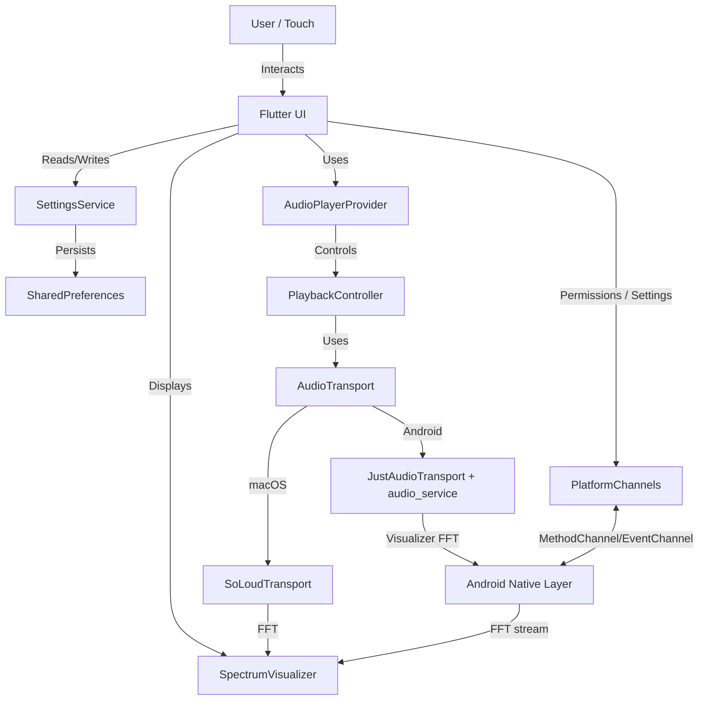

# System Architecture Overview

Nothingness is a Flutter-based media visualizer with a clean three-layer audio architecture: `PlaybackController` (business logic), `AudioTransport` (thin transport interface), and platform-specific transport implementations (SoLoud on macOS, just_audio on Android). Spectrum data comes from the active transport (SoLoud FFT on macOS, Android visualizer tied to the player session), with microphone capture as an optional/fallback Android path.

## High-Level Diagram

## Key Components

### 1. Flutter UI Layer
-   **`MediaControllerPage`**: The main entry point and orchestrator. It manages the layout, including the main visualizer area and the slide-out settings panel. It switches between different screens:
    -   **`SpectrumScreen`**: Standard bar visualizer.
    -   **`PoloScreen`**: Retro LCD-style display.
    -   **`DotScreen`**: Minimalist fluctuating dot interface.
-   **`ScaledLayout`**: A wrapper widget that ensures the entire UI is scaled consistently across different screen DPIs. It now wraps the entire `MediaControllerPage` content (including the Settings overlay) to ensure consistent scaling for all elements (see [UI Scaling](ui-scaling.md)).
    -   **Library Panel**: A swipe-up/arrow-triggered panel with tabs for Now Playing (queue controls) and Folders (folder picker, Play All with recursive enqueue).

### 2. Service Layer
-   **`SettingsService`**: A singleton service responsible for managing application state.
    -   **Spectrum Settings**: Visualizer configuration (colors, bar count, decay speed).
    -   **Audio Source**: Switch between transport-driven spectrum (default) and microphone capture (Android-only fallback).
    -   **UI Scale**: System-wide scaling factor.
    -   **Screen Configuration**: Manages active screen/skin selection (see [Skins & Screens](skins.md)).
    -   **Full Screen Mode**: Immersive sticky mode that hides system status/navigation bars via `SystemChrome`.
    -   **Persistence**: Saves/loads state to disk using `SharedPreferences`.
-   **`AudioPlayerProvider`**: `ChangeNotifier` that wraps a `PlaybackController` and exposes state (`songInfo`, `isPlaying`, `queue`, `shuffle`, spectrum stream) to the UI.
-   **`PlaybackController`**: Single source of truth for playback logic. Manages user intent (via `PlayIntent` enum), queue state (via `PlaylistStore`), error recovery policy, and `isNotFound` tracking. Coordinates with `AudioTransport` for native player control. Handles all skip-on-error logic in Dart, respecting user intent when errors occur.
-   **`AudioTransport` (interface)**: Thin abstraction over platform-specific players. Provides minimal interface for loading files, play/pause/seek control, position/duration queries, and event emission (error, ended, loaded, position). Does not handle queue management or skip logic.
    -   **`SoLoudTransport` (macOS)**: Thin wrapper around `flutter_soloud` for playback and FFT. SoLoud native libraries are excluded from Android builds to keep APK size down.
    -   **`JustAudioTransport` (Android)**: Thin wrapper around `just_audio` + `audio_service`/`just_audio_background` for playback, media session, notifications, and headset/lock-screen controls. Spectrum comes from the Android visualizer API tied to the player session. Android packaging targets only `arm64-v8a` (no `armeabi-v7a`/`x86_64`). No `maxSkipsOnError` - all skipping handled by `PlaybackController`.
-   **`PlatformChannels`**: Android bridge for permissions and visualizer/mic spectrum events.

### 3. Native Layer (Android)
-   **`AudioCaptureService`**: A native Android service that hooks into the system audio output to capture frequency data.
-   **Method Channels**: Standard Flutter mechanism for passing messages between Dart and Kotlin/Java.

## Data Flow
1.  **Startup**: `NothingApp` awaits `AudioPlayerProvider.init()` which instantiates the platform `AudioTransport` (SoLoud on macOS; just_audio on Android), creates a `PlaybackController` with that transport, and initializes both. The controller restores playlists via `PlaylistStore`. `SettingsService` loads preferences. `PlatformChannels` is ready for Android permissions/visualizer events.
2.  **Runtime (default transport spectrum)**: UI watches `AudioPlayerProvider`; provider relays controller state (`songInfo`, `queue`, `isPlaying`, spectrum stream). Spectrum comes from transport FFT (SoLoud) or Android visualizer tied to the player session.
3.  **Runtime (microphone fallback, Android)**: If selected in settings, provider disables transport spectrum and subscribes to the mic EventChannel stream from native; bars render directly from that stream.
4.  **User Action**: Settings changes update notifiers and rebuild UI; spectrum source switches immediately. Android surfaces mic/notification permission prompts when needed; background controls are managed by `audio_service`/`just_audio_background`. Playback actions (play/pause/next/previous) update `PlaybackController`'s `userIntent`, which determines error recovery behavior (skip on error only if user wants to play).

## Audio

-   **Audio playback**: Three-layer architecture separates concerns:
    -   **`PlaybackController`**: Manages user intent (`PlayIntent` enum), queue state, error recovery policy, and `isNotFound` tracking. Single source of truth for playback logic. Checks `userIntent` before deciding to skip on error (prevents race conditions between pause and auto-skip).
    -   **`AudioTransport`**: Thin interface for native player control (load, play, pause, seek, events). No queue awareness, no skip logic.
    -   **Platform implementations**:
        -   **macOS**: `SoLoudTransport` (flutter_soloud) provides playback and FFT for spectrum.
        -   **Android**: `JustAudioTransport` (just_audio + audio_service/just_audio_background) provides playback, media session, notification, headset/lock-screen controls; spectrum comes from the Android visualizer API bound to the player session.
-   **Spectrum visualization**: Default source is the active transport's FFT/visualizer stream. `SpectrumProvider` implementations remain, but microphone capture is now an Android-only fallback via EventChannel; macOS stays player-only. Settings can switch sources without restarting the UI.

