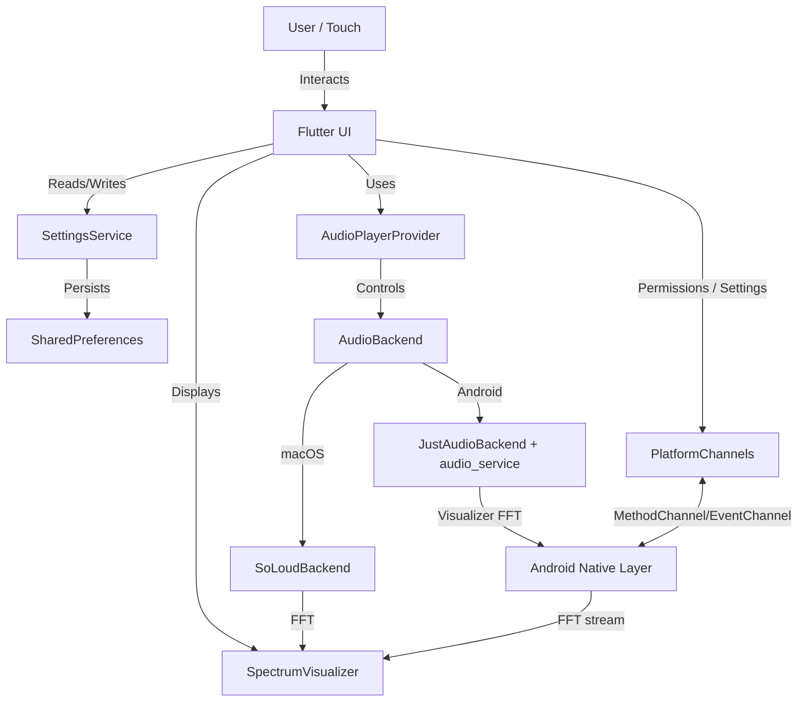

# System Architecture Overview

Nothingness is a Flutter-based media visualizer with platform-specific audio backends hidden behind a single interface. macOS uses SoLoud; Android uses just_audio + audio_service for playback, media session, and background controls. Spectrum data comes from the active backend (SoLoud FFT on macOS, Android visualizer tied to the player session), with microphone capture as an optional/fallback Android path.

## High-Level Diagram

## Key Components

### 1. Flutter UI Layer
-   **`MediaControllerPage`**: The main entry point and orchestrator. It manages the layout, including the main visualizer area and the slide-out settings panel. It switches between different screens:
    -   **`SpectrumScreen`**: Standard bar visualizer.
    -   **`PoloScreen`**: Retro LCD-style display.
    -   **`DotScreen`**: Minimalist fluctuating dot interface.
-   **`ScaledLayout`**: A wrapper widget that ensures the entire UI is scaled consistently across different screen DPIs. It now wraps the entire `MediaControllerPage` content (including the Settings overlay) to ensure consistent scaling for all elements (see [UI Scaling](ui-scaling.md)).
    -   **Library Panel**: A swipe-up/arrow-triggered panel with tabs for Now Playing (queue controls) and Folders (folder picker, Play All with recursive enqueue).

### 2. Service Layer
-   **`SettingsService`**: A singleton service responsible for managing application state.
    -   **Spectrum Settings**: Visualizer configuration (colors, bar count, decay speed).
    -   **Audio Source**: Switch between backend-driven spectrum (default) and microphone capture (Android-only fallback).
    -   **UI Scale**: System-wide scaling factor.
    -   **Screen Configuration**: Manages active screen/skin selection (see [Skins & Screens](skins.md)).
    -   **Full Screen Mode**: Immersive sticky mode that hides system status/navigation bars via `SystemChrome`.
    -   **Persistence**: Saves/loads state to disk using `SharedPreferences`.
-   **`AudioPlayerProvider`**: `ChangeNotifier` that wraps an `AudioBackend` implementation and exposes state (`songInfo`, `isPlaying`, `queue`, `shuffle`, spectrum stream) to the UI.
-   **`AudioBackend` (interface)**: Platform-specific playback + spectrum behind one contract.
    -   **`SoLoudBackend` (macOS)**: Uses `flutter_soloud` for playback and FFT. SoLoud native libraries are excluded from Android builds to keep APK size down.
    -   **`JustAudioBackend` (Android)**: Uses `just_audio` + `audio_service`/`just_audio_background` for playback, media session, notifications, and headset/lock-screen controls. Spectrum comes from the Android visualizer API tied to the player session. Android packaging targets only `arm64-v8a` (no `armeabi-v7a`/`x86_64`).
-   **`PlatformChannels`**: Android bridge for permissions and visualizer/mic spectrum events.

### 3. Native Layer (Android)
-   **`AudioCaptureService`**: A native Android service that hooks into the system audio output to capture frequency data.
-   **Method Channels**: Standard Flutter mechanism for passing messages between Dart and Kotlin/Java.

## Data Flow
1.  **Startup**: `NothingApp` awaits `AudioPlayerProvider.init()` which instantiates the platform `AudioBackend` (SoLoud on macOS; just_audio + audio_service on Android) and restores playlists. `SettingsService` loads preferences. `PlatformChannels` is ready for Android permissions/visualizer events.
2.  **Runtime (default backend spectrum)**: UI watches `AudioPlayerProvider`; provider relays backend state (`songInfo`, `queue`, `isPlaying`, spectrum stream). Spectrum comes from backend FFT (SoLoud) or Android visualizer tied to the player session.
3.  **Runtime (microphone fallback, Android)**: If selected in settings, provider disables backend spectrum and subscribes to the mic EventChannel stream from native; bars render directly from that stream.
4.  **User Action**: Settings changes update notifiers and rebuild UI; spectrum source switches immediately. Android surfaces mic/notification permission prompts when needed; background controls are managed by `audio_service`/`just_audio_background`.

## Audio

-   **Audio playback**: `AudioBackend` abstraction hides platform differences.
    -   **macOS**: `SoLoudBackend` (flutter_soloud) handles playback/queue and provides FFT for spectrum.
    -   **Android**: `JustAudioBackend` (just_audio + audio_service/just_audio_background) handles playback, media session, notification, headset/lock-screen controls; spectrum comes from the Android visualizer API bound to the player session.
-   **Spectrum visualization**: Default source is the active backend’s FFT/visualizer stream. `SpectrumProvider` implementations remain, but microphone capture is now an Android-only fallback via EventChannel; macOS stays player-only. Settings can switch sources without restarting the UI.

