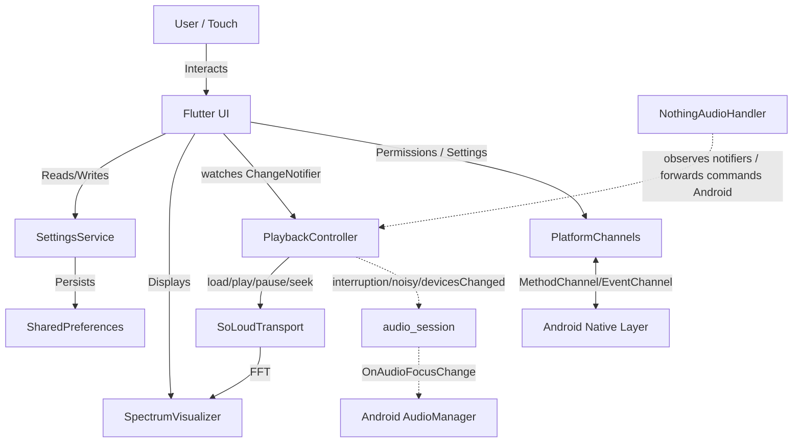

# System Architecture Overview

Nothingness is a Flutter-based media visualizer with a clean audio architecture: `PlaybackController` (business logic, a `ChangeNotifier`), `AudioTransport` (thin transport interface), and a single playback engine — `SoLoudTransport` (`flutter_soloud`) — on both macOS and Android. The UI watches `PlaybackController` **directly** via `ChangeNotifierProvider<PlaybackController>` — there is no wrapping provider. On Android, an `audio_service` `AudioHandler` (`NothingAudioHandler`) wraps the **same** controller as a pure observer + command-forwarder: it observes the controller's notifiers to mirror MediaSession/notification state and forwards OS media-button commands back to it. Spectrum data comes from SoLoud's FFT (extracted into `SpectrumSource`), with microphone capture as an optional/fallback Android path. Audio focus and route-change events from `audio_session` are handled in `PlaybackController` (pause on phone calls, resume on focus regain, pause on becoming-noisy). Telemetry/logging is extracted to `PlaybackTelemetry`, which logs via `package:logging` (`Logger('nothingness.*')`).

## High-Level Diagram

```mermaid
graph TD
    User[User / Touch] --> |Interacts| UI[Flutter UI]
    UI --> |Reads/Writes| Settings[SettingsService]
    UI --> |Displays| Vis[SpectrumVisualizer]
    UI --> |watches ChangeNotifier| Controller[PlaybackController]
    Handler[NothingAudioHandler] -.-> |observes notifiers / forwards commands Android| Controller
    Controller --> |load/play/pause/seek| Transport[SoLoudTransport]
    Controller -.->|interruption/noisy/devicesChanged| AS[audio_session]
    AS -.->|OnAudioFocusChange| OS[Android AudioManager]
    UI --> |Permissions / Settings| PC[PlatformChannels]

    Settings --> |Persists| SP[SharedPreferences]
    PC <--> |MethodChannel/EventChannel| Native[Android Native Layer]
    Transport --> |FFT| Vis
```

## Key Components

### 1. Flutter UI Layer

Widgets are `flutter_hooks` `HookWidget`s — state lives in hooks (`useState`, `useEffect`, `useListenable`) rather than `StatefulWidget`/`initState`/`dispose` boilerplate. Cross-widget imperative coordination that used to ride on `GlobalKey<State>` now flows through small reactive controllers: `HeroFlashController` (drives the `HeroFeedbackSurface` swipe-flash) and `VoidBrowserController` (scroll-the-browser-to-track).

-   **`MediaControllerPage`**: The main entry point and orchestrator. It owns the active `ScreenConfig`, and hands off rendering to a single shell, `VoidScreen`.
-   **`VoidScreen`** (`lib/screens/void_screen.dart`): The unified chrome for all skins. It hosts a pluggable **hero** (`SpectrumHero` / `PoloHero` / `DotHero` / `VoidHero` under `lib/widgets/heroes/`), a sliding library browser (`VoidBrowser`, with full-name recursive search), a configurable transport row (`TransportRow`), and the settings sheet (`VoidSettingsSheet`).
-   **Theme abstraction** (`lib/theme/`): `app_palette.dart`, `app_typography.dart`, `app_geometry.dart`, `themes.dart`, and per-theme palettes (`palettes/void_dark.dart`, `void_light.dart`). Drives the `ThemeId` / `ThemeVariant` enums and the dark / light / auto switching surfaced in settings.
-   **`ScaledLayout`**: A wrapper widget that ensures the entire UI is scaled consistently across different screen DPIs. It still wraps the entire `MediaControllerPage` content (including the settings sheet) to ensure consistent scaling (see [UI Scaling](ui-scaling.md)).
-   **Browser**: `VoidBrowser` is the swipe-up library browser, with last-folder restore, breadcrumb, and a `BrowserPresentation` enum that controls whether it sits as a permanent strip or slides up over the hero.

### 2. Service Layer
-   **`SettingsService`**: A singleton service responsible for managing application state.
    -   **Spectrum Settings**: Visualizer configuration (colors, bar count, decay speed).
    -   **Audio Source**: Switch between transport-driven spectrum (default) and microphone capture (Android-only fallback).
    -   **UI Scale**: System-wide scaling factor.
    -   **Screen Configuration**: Manages active screen/skin selection (see [Skins & Screens](skins.md)).
    -   **Full Screen Mode**: Immersive sticky mode that hides system status/navigation bars via `SystemChrome`.
    -   **Persistence**: Saves/loads state to disk using `SharedPreferences`.
-   **`PlaybackController`**: `ChangeNotifier` and single source of truth for playback logic, watched directly by the UI. Manages user intent (via `PlayIntent` enum), queue state (via `PlaylistStore`), error recovery policy, and `isNotFound` tracking. Coordinates with `AudioTransport` for native player control. Handles all skip-on-error logic in Dart, respecting user intent when errors occur. Telemetry is delegated to `PlaybackTelemetry` and spectrum sourcing to `SpectrumSource`.
-   **`NothingAudioHandler` (Android)**: `audio_service` handler that owns the MediaSession/notification state. It wraps the same `PlaybackController` as a pure observer + command-forwarder — it observes the controller's notifiers to mirror queue/media-item/playback state for the OS and forwards OS media-button commands (play/pause/next/previous/seek) back to the controller. No `customAction` IPC bridge.
-   **`PlaybackTelemetry`**: Extracted from `PlaybackController`; emits structured logs through `package:logging` (`Logger('nothingness.*')`).
-   **`SpectrumSource`**: Extracted from `PlaybackController`; owns FFT/spectrum sourcing.
-   **`AudioTransport` (interface)**: Thin abstraction over the native player. Provides minimal interface for loading files, play/pause/seek control, position/duration queries, and event emission (error, ended, loaded, position). Does not handle queue management or skip logic.
    -   **`SoLoudTransport`** (macOS + Android): Thin wrapper around `flutter_soloud` (4.x) for playback and FFT. Single transport across platforms. Android packaging targets only `arm64-v8a` (no `armeabi-v7a`/`x86_64`). Built against a **local fork** of `flutter_soloud` (git submodule at `./soloud`, via `dependency_overrides`) that adds native Opus decoding to `loadFile`/`loadMem` so Opus decodes off the UI isolate like mp3 (see `B-051`); revert to the pub.dev package once upstreamed.
-   **Audio focus / route handling**: `PlaybackController` subscribes to `audio_session` streams in `init()`:
    -   `interruptionEventStream`: pauses on focus loss (phone call, navigation prompt) while preserving `PlayIntent.play`; auto-resumes on focus regain. Permanent focus loss (`unknown`) does not auto-resume.
    -   `becomingNoisyEventStream`: treats headphones/BT disconnect mid-playback as an explicit user pause (flips `PlayIntent` to `pause`); no auto-resume on subsequent focus regain.
    -   `devicesChangedEventStream`: logs added/removed output devices into the audio-event ring buffer (used to diagnose BT route swaps).
-   **`PlatformChannels`**: Android bridge for permissions and mic spectrum events.

### 3. Native Layer (Android)
-   **`AudioCaptureService`**: A native Android service that hooks into the system audio output to capture frequency data.
-   **Method Channels**: Standard Flutter mechanism for passing messages between Dart and Kotlin/Java.

## Data Flow
1.  **Startup**: bootstrap constructs a `SoLoudTransport` + `PlaybackController` pair and awaits `PlaybackController.init()`, which initializes the transport, subscribes to transport events, and subscribes to `audio_session` interruption / becoming-noisy / devices-changed streams. On Android, `NothingAudioHandler` is brought up to observe the controller and own MediaSession/notification state. The controller restores playlists via `PlaylistStore`. `SettingsService` loads preferences.
2.  **Runtime (default transport spectrum)**: UI watches `PlaybackController` directly via `ChangeNotifierProvider<PlaybackController>` for controller state (`songInfo`, `queue`, `isPlaying`) and spectrum. Spectrum comes from SoLoud FFT on both platforms.
3.  **Runtime (microphone fallback, Android)**: If selected in settings, transport spectrum is disabled and bars render from the mic EventChannel stream delivered via `PlatformChannels`.
4.  **User Action**: Settings changes update notifiers and rebuild UI; spectrum source switches immediately. Android surfaces mic/notification permission prompts when needed; MediaSession/notification state is owned by `NothingAudioHandler` (audio_service). Playback actions (play/pause/next/previous) ultimately update `PlaybackController`'s intent and queue state, which drives deterministic error recovery and skipping.
5.  **OS audio focus / route changes**: A phone call, navigation prompt, or BT disconnect raises an event on `audio_session`; `PlaybackController` handles it without going through the UI — pauses on focus loss (or noisy), auto-resumes on focus regain, and writes a timestamped line into the audio-event ring buffer (`diagnosticsSnapshot()['audioEvents']`) for after-the-fact debugging.

## Audio

-   **Audio playback**: Three-layer architecture separates concerns:
    -   **`PlaybackController`**: Manages user intent (`PlayIntent` enum), queue state, error recovery policy, `isNotFound` tracking, and audio focus / route handling (via `audio_session` subscriptions). Single source of truth for playback logic. Checks `userIntent` before deciding to skip on error (prevents race conditions between pause and auto-skip).
    -   **`AudioTransport`**: Thin interface for native player control (load, play, pause, seek, events). No queue awareness, no skip logic, no focus awareness.
    -   **Single transport**: `SoLoudTransport` (`flutter_soloud` 4.x) on both macOS and Android. On Android, `NothingAudioHandler` (audio_service) wraps `PlaybackController` to own MediaSession/notification state.
-   **Spectrum visualization**: Default source is SoLoud's FFT (sourced via `SpectrumSource`). Microphone capture is an Android-only fallback delivered via a `PlatformChannels` EventChannel; macOS stays player-only. Settings can switch sources without restarting the UI.

