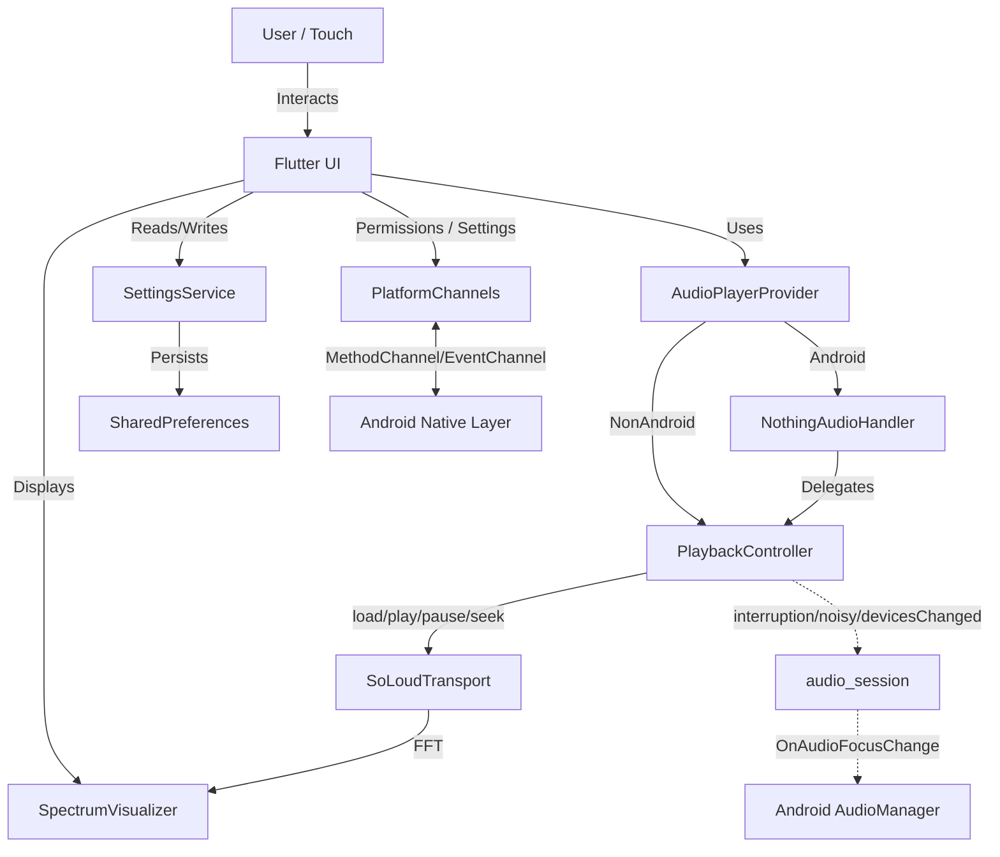

# System Architecture Overview

Nothingness is a Flutter-based media visualizer with a clean audio architecture: `PlaybackController` (business logic), `AudioTransport` (thin transport interface), and a single playback engine — `SoLoudTransport` (`flutter_soloud`) — on both macOS and Android. On Android, an `audio_service` `AudioHandler` (`NothingAudioHandler`) owns MediaSession/notification state and delegates playback decisions to `PlaybackController`. Spectrum data comes from SoLoud's FFT, with microphone capture as an optional/fallback Android path. Audio focus and route-change events from `audio_session` are handled in `PlaybackController` (pause on phone calls, resume on focus regain, pause on becoming-noisy).

## High-Level Diagram

```mermaid
graph TD
    User[User / Touch] --> |Interacts| UI[Flutter UI]
    UI --> |Reads/Writes| Settings[SettingsService]
    UI --> |Displays| Vis[SpectrumVisualizer]
    UI --> |Uses| Provider[AudioPlayerProvider]
    Provider --> |Android| Handler[NothingAudioHandler]
    Provider --> |NonAndroid| Controller[PlaybackController]
    Handler --> |Delegates| Controller
    Controller --> |load/play/pause/seek| Transport[SoLoudTransport]
    Controller -.->|interruption/noisy/devicesChanged| AS[audio_session]
    AS -.->|OnAudioFocusChange| OS[Android AudioManager]
    UI --> |Permissions / Settings| PC[PlatformChannels]

    Settings --> |Persists| SP[SharedPreferences]
    PC <--> |MethodChannel/EventChannel| Native[Android Native Layer]
    Transport --> |FFT| Vis
```

## Key Components

### 1. Flutter UI Layer
-   **`MediaControllerPage`**: The main entry point and orchestrator. It manages the layout, including the main visualizer area and the slide-out settings panel. It switches between different screens:
    -   **`SpectrumScreen`**: Standard bar visualizer.
    -   **`PoloScreen`**: Retro LCD-style display.
    -   **`DotScreen`**: Minimalist fluctuating dot interface.
-   **`ScaledLayout`**: A wrapper widget that ensures the entire UI is scaled consistently across different screen DPIs. It now wraps the entire `MediaControllerPage` content (including the Settings overlay) to ensure consistent scaling for all elements (see [UI Scaling](ui-scaling.md)).
    -   **Library Panel**: A swipe-up/arrow-triggered panel with tabs for Now Playing (queue controls) and Folders (folder picker, Play All with recursive enqueue).

### 2. Service Layer
-   **`SettingsService`**: A singleton service responsible for managing application state.
    -   **Spectrum Settings**: Visualizer configuration (colors, bar count, decay speed).
    -   **Audio Source**: Switch between transport-driven spectrum (default) and microphone capture (Android-only fallback).
    -   **UI Scale**: System-wide scaling factor.
    -   **Screen Configuration**: Manages active screen/skin selection (see [Skins & Screens](skins.md)).
    -   **Full Screen Mode**: Immersive sticky mode that hides system status/navigation bars via `SystemChrome`.
    -   **Persistence**: Saves/loads state to disk using `SharedPreferences`.
-   **`AudioPlayerProvider`**: `ChangeNotifier` that wraps a `PlaybackController` and exposes state (`songInfo`, `isPlaying`, `queue`, `shuffle`, spectrum stream) to the UI.
-   **`NothingAudioHandler` (Android)**: `audio_service` handler that owns the MediaSession/notification state. It mirrors queue/media item/playback state for the OS, and delegates playback logic (queue/index/shuffle/error recovery) to `PlaybackController`.
-   **`PlaybackController`**: Single source of truth for playback logic. Manages user intent (via `PlayIntent` enum), queue state (via `PlaylistStore`), error recovery policy, and `isNotFound` tracking. Coordinates with `AudioTransport` for native player control. Handles all skip-on-error logic in Dart, respecting user intent when errors occur.
-   **`AudioTransport` (interface)**: Thin abstraction over the native player. Provides minimal interface for loading files, play/pause/seek control, position/duration queries, and event emission (error, ended, loaded, position). Does not handle queue management or skip logic.
    -   **`SoLoudTransport`** (macOS + Android): Thin wrapper around `flutter_soloud` (4.x) for playback and FFT. Single transport across platforms. Android packaging targets only `arm64-v8a` (no `armeabi-v7a`/`x86_64`).
-   **Audio focus / route handling**: `PlaybackController` subscribes to `audio_session` streams in `init()`:
    -   `interruptionEventStream`: pauses on focus loss (phone call, navigation prompt) while preserving `PlayIntent.play`; auto-resumes on focus regain. Permanent focus loss (`unknown`) does not auto-resume.
    -   `becomingNoisyEventStream`: treats headphones/BT disconnect mid-playback as an explicit user pause (flips `PlayIntent` to `pause`); no auto-resume on subsequent focus regain.
    -   `devicesChangedEventStream`: logs added/removed output devices into the audio-event ring buffer (used to diagnose BT route swaps).
-   **`PlatformChannels`**: Android bridge for permissions and mic spectrum events.

### 3. Native Layer (Android)
-   **`AudioCaptureService`**: A native Android service that hooks into the system audio output to capture frequency data.
-   **Method Channels**: Standard Flutter mechanism for passing messages between Dart and Kotlin/Java.

## Data Flow
1.  **Startup**: `NothingApp` awaits `AudioPlayerProvider.init()` which (on Android) brings up `NothingAudioHandler` or (elsewhere) constructs a `SoLoudTransport` + `PlaybackController` pair directly. `PlaybackController.init()` initializes the transport, subscribes to transport events, and subscribes to `audio_session` interruption / becoming-noisy / devices-changed streams. The controller restores playlists via `PlaylistStore`. `SettingsService` loads preferences.
2.  **Runtime (default transport spectrum)**: UI watches `AudioPlayerProvider`; provider relays controller state (`songInfo`, `queue`, `isPlaying`, spectrum stream). Spectrum comes from SoLoud FFT on both platforms.
3.  **Runtime (microphone fallback, Android)**: If selected in settings, provider disables transport spectrum and subscribes to the mic EventChannel stream from native; bars render directly from that stream.
4.  **User Action**: Settings changes update notifiers and rebuild UI; spectrum source switches immediately. Android surfaces mic/notification permission prompts when needed; MediaSession/notification state is owned by `NothingAudioHandler` (audio_service). Playback actions (play/pause/next/previous) ultimately update `PlaybackController`'s intent and queue state, which drives deterministic error recovery and skipping.
5.  **OS audio focus / route changes**: A phone call, navigation prompt, or BT disconnect raises an event on `audio_session`; `PlaybackController` handles it without going through the UI — pauses on focus loss (or noisy), auto-resumes on focus regain, and writes a timestamped line into the audio-event ring buffer (`diagnosticsSnapshot()['audioEvents']`) for after-the-fact debugging.

## Audio

-   **Audio playback**: Three-layer architecture separates concerns:
    -   **`PlaybackController`**: Manages user intent (`PlayIntent` enum), queue state, error recovery policy, `isNotFound` tracking, and audio focus / route handling (via `audio_session` subscriptions). Single source of truth for playback logic. Checks `userIntent` before deciding to skip on error (prevents race conditions between pause and auto-skip).
    -   **`AudioTransport`**: Thin interface for native player control (load, play, pause, seek, events). No queue awareness, no skip logic, no focus awareness.
    -   **Single transport**: `SoLoudTransport` (`flutter_soloud` 4.x) on both macOS and Android. On Android, `NothingAudioHandler` (audio_service) wraps `PlaybackController` to own MediaSession/notification state.
-   **Spectrum visualization**: Default source is SoLoud's FFT. `SpectrumProvider` implementations remain, but microphone capture is an Android-only fallback via EventChannel; macOS stays player-only. Settings can switch sources without restarting the UI.

