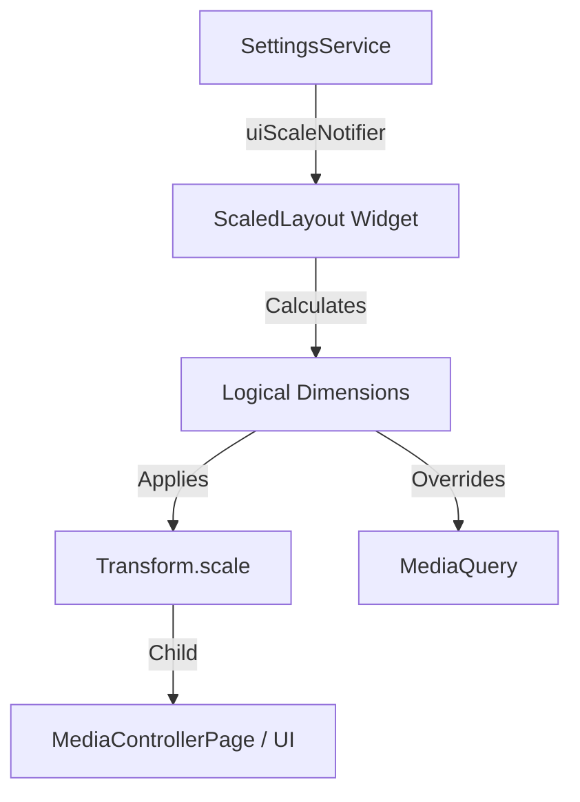

# Global UI Scaling

This document details the implementation of the global UI scaling system used to support varied screen sizes and DPIs, particularly for automotive displays.

## The Problem
Automotive Android systems often have non-standard screen dimensions and pixel densities. Standard Flutter apps may render with tiny text and UI elements on high-resolution dashboard screens.

## The Solution
We implemented a **Global UI Scaling** mechanism that applies a scale factor to the entire application layout, simulating a lower (or higher) resolution screen while maintaining vector sharpness.

### Architecture



### Key Components

#### 1. `ScaledLayout`
Located in `lib/widgets/scaled_layout.dart`. This is the core widget responsible for scaling.
-   **Input**: Listens to `SettingsService.uiScaleNotifier`.
-   **Operation**:
    1.  Calculates `logicalWidth = physicalWidth / uiScale`.
    2.  Wraps child in `Transform.scale(scale: uiScale)`.
    3.  Wraps child in `SizedBox(width: logicalWidth, ...)` to constrain the layout.
    4.  Overrides `MediaQuery` data to report the logical size to children.
-   **Benefit**: Child widgets are completely unaware of the scaling. They layout normally within the logical bounds.

#### 2. `SettingsService` & Auto-Calculation
Located in `lib/services/settings_service.dart`.
-   **Separation**: `uiScale` is stored separately from `SpectrumSettings` to avoid coupling visualizer config with system config.
-   **Auto-Detection**: On first launch (`uiScale == -1`), the app calculates a "Smart Scale" based on the screen width (`calculateSmartScaleForWidth`).
    -   Target logical width: ~600dp.
    -   Formula: `scale = physicalWidth / 600.0`.
    -   Result is clamped between 1.0 and 3.0.

### Usage
The `ScaledLayout` is applied at the highest level of the specific screen (e.g., inside `MediaControllerPage`'s `Stack`) rather than at `MaterialApp.builder` to ensure overlays and positioned elements (like the Settings Panel) are scaled correctly together.

```dart
// Example Usage
ScaledLayout(
  child: Scaffold(
    // body...
  ),
);
```

