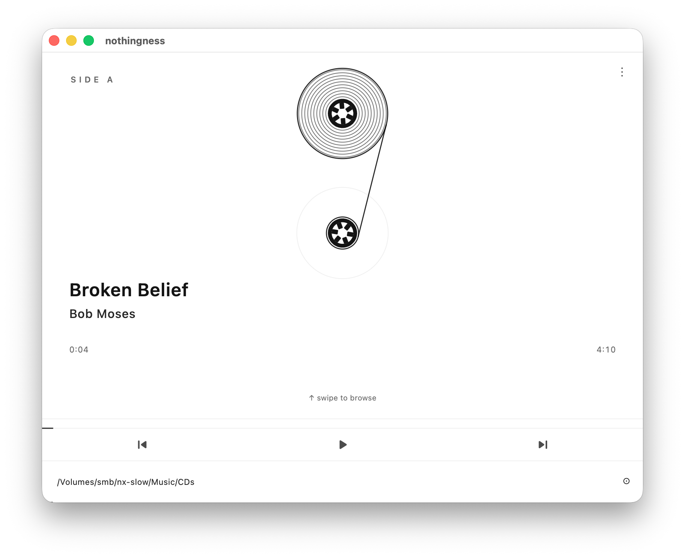
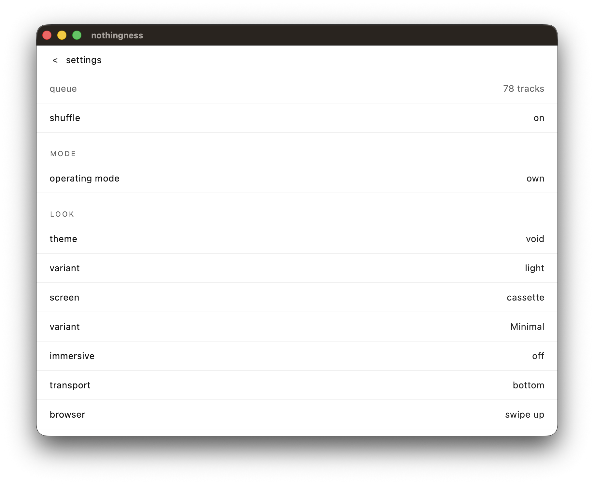
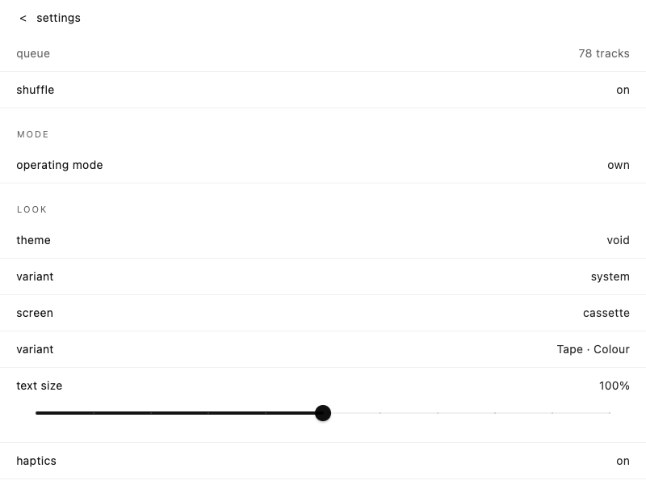
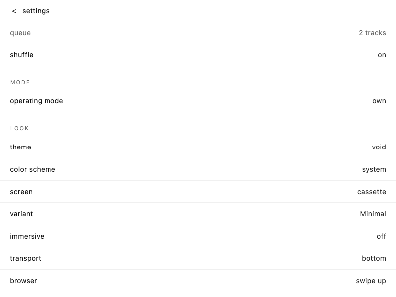
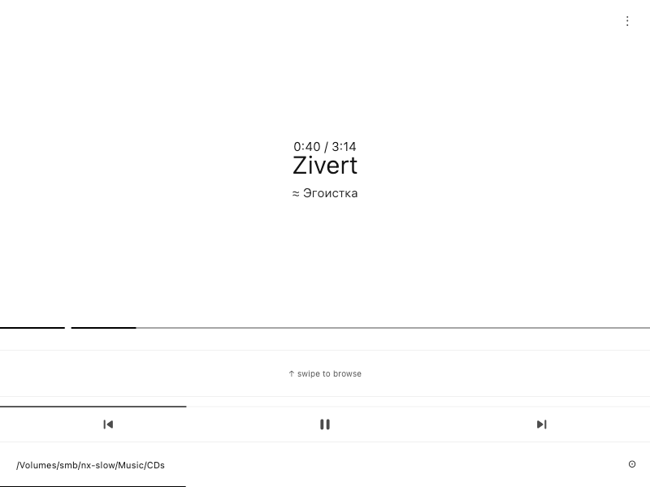
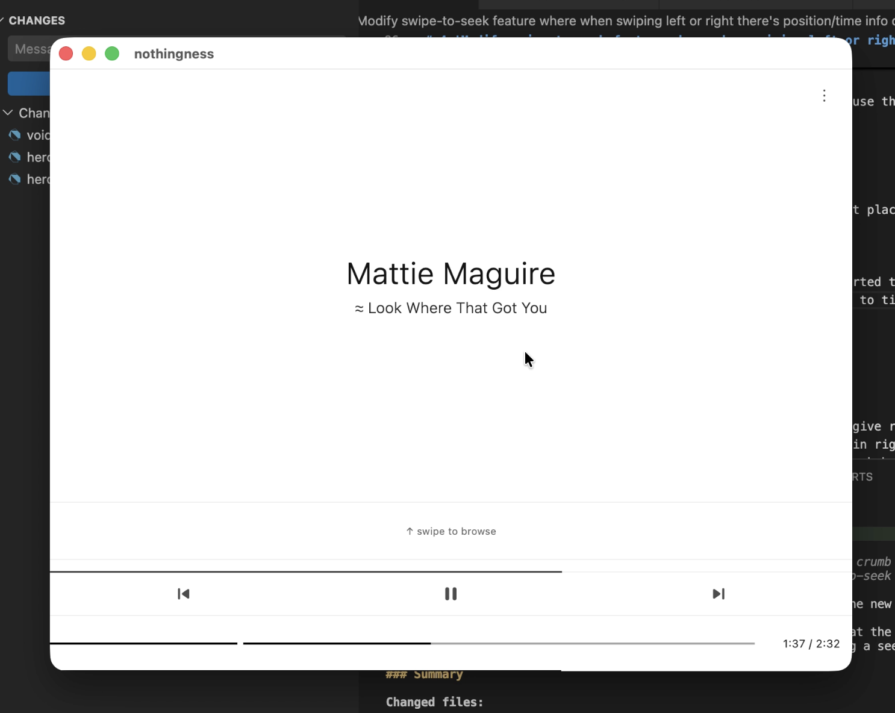
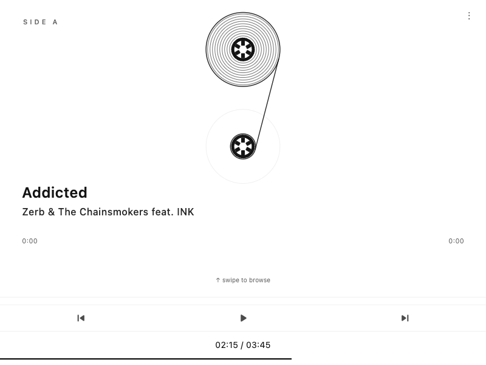

# Env

- LM Studio 0.4.16 (Build 2)
- CUDA 12 llama.cpp (Windows) v2.21.0
- RTX 4090 24GB VRAM
- Core i5 13600k, 64GB RAM

# Goal

Test if local models that can run on consumer hardwer are worth the time. Previously I never sawe viable local and SLMs and considered that any private small model will be better, local models where a joke. Though looking at Qwen 3.6 27B and 35B results, what peopel built with it I decided to give it a try, along with Gemma 4 models. Used GPT 5.4 Mini Medium as a basline, occasionaly implemented one of the scanrious with GPT 5.3 Code Medium (proving that #4 is doable and adjusting the harness for other models to use it). This test is not some greenfield web app as in most cases, it's a live [Flutter code base with ~15k lines of code](https://github.com/maxim-saplin/nothingness), AI grown with SOTA with plenty of skills and sophisticated app harness around app driving and verification. The tests focus on agentic end-to-end scenarious around app driving, runtime validationa and maintasining an existing code base in non trivial for AI langiuuage (Dart). Using pi coding agent as agent harness.

# 1 "Drive macOS app, smoke test play/pause, skip and fast forward"



## gpt-5.4-mini-medium - Good (3)

Azure Enterprise Subscritin had throttles the model heaviliy, slow, many retries

↑86k ↓2.6k R542k CH85.9% $0.117 20.6%/400k (auto) 

## qwen3.6-35b-a3b@q4_k_m - Average (2)

Had some confusion around starting the app and spent to many steps figuring out, reported id did fast forward by 60s - in fact that didn't happen. 100 tok/s, MoE offload to RAM

↑913k ↓6.1k 16.2%/262k (auto)

## gemma-4-26b-a4b-qat@q4_0 - FAIL (0)

The model didn't understand it needed to drive the live app, for some reasons tryied to used widget tests, even modified one of the files. Some requests where to long (10k+ reasoning tokens) and while it is fast at 180tok/s and completely fits in VRAM it felt slow.

↑1.5M ↓18k 28.0%/262k (auto)

### "/skill:agent-emulator-debugging Drive macOS app, smoke test play/pause, skip and fast forward" - FAIL (0)

Before even the app launched the agent got some CLI hanging (interrupted at 900s and asked to proceed). For some reasons it decided to run web app (`flutter run -d chrome --debug -t dev/main_debug.dart    `) while the prompt directly asked macOS... Stopped my attempts.

↑668k ↓6.8k 16.6%/262k (auto)

## gemma-4-12b-qat@q4_0 - FAIL (0)

First it ran Flutter widget tests, started streaming report and crashed. Interestengly, both Gemma models (12B and 26B) I tested on https://github.com/maxim-saplin/llm_arithmetic and it crashed as well.

`Error: The model has crashed without additional information. (Exit code: 18446744072635812000)`

↑319k ↓1.9k 19.0%/262k (auto)

### "/skill:agent-emulator-debugging Drive macOS app, smoke test play/pause, skip and fast forward" - BAD (1)

Started 2 apps, mid way model reloaded on LM Studio had to manualy ask to proceed, then it crashed again... When eventually it worked it only tested play and skip.

↑478k ↓6.4k 17.9%/262k (auto)

## gemini/gemma-4-26b-a4b-it - BAD(1)

Did launch the app, though one of CLIs stayed running for 350+s, had to intervene and nudge. Then it succesfully launched the app and started switching track, though went into loops confused with actions, found some imagenary bug there was not. Had to interrupt long chain, it even decided to change one of the files for some reasone...

↑721k ↓53k R5.0M CH0.0% 57.4%/262k (auto)

## gemini/gemma-4-31b-it - Good (3)

Tested all requested features, provided report.

```
 The macOS app was successfully driven and smoke tested using drive.py.                                                                                                        
                                                                                                                                                                               
 ### Test Setup                                                                                                                                                                
                                                                                                                                                                               
 - Target: macOS desktop build (-d macos).                                                                                                                                     
 - Driving Tool: drive.py via VM service extensions.                                                                                                                           
 - Test Assets: Library tracks from /Volumes/smb/nx-slow/Music/CDs/cd89/.                                                                                                      
                                                                                                                                                                               
 ### Smoke Test Results                                                                                                                                                        
                                                                                                                                                                               
 ┌──────────────┬────────────────────────────────────────────────┬─────────────────────────────────────────────────────────────┬──────────────────────────────────┬──────────┐ 
 │ Feature      │ Action                                         │ Expected Result                                             │ Actual Result                    │ Status   │ 
 ├──────────────┼────────────────────────────────────────────────┼─────────────────────────────────────────────────────────────┼──────────────────────────────────┼──────────┤ 
 │ Play/Pause   │ resume $\rightarrow$ pause $\rightarrow$       │ isPlaying toggles true $\rightarrow$ false $\rightarrow$    │ Verified via inspect             │ ✅       │ 
 │              │ resume                                         │ true                                                        │                                  │ Passed   │ 
 ├──────────────┼────────────────────────────────────────────────┼─────────────────────────────────────────────────────────────┼──────────────────────────────────┼──────────┤ 
 │ Skip         │ setQueue(T1, T2) $\rightarrow$ next            │ Current track changes from T1 to T2                         │ Verified via inspect paths       │ ✅       │ 
 │              │                                                │                                                             │                                  │ Passed   │ 
 ├──────────────┼────────────────────────────────────────────────┼─────────────────────────────────────────────────────────────┼──────────────────────────────────┼──────────┤ 
 │ Fast Forward │ seek 0:05                                      │ position jumps to $\approx 5000\text{ms}$                   │ position moved to                │ ✅       │ 
 │              │                                                │                                                             │ $5928\text{ms}$                  │ Passed   │ 
 └──────────────┴────────────────────────────────────────────────┴─────────────────────────────────────────────────────────────┴──────────────────────────────────┴──────────┘ 
                                                                                                                                                                               
 ### Summary of Execution                                                                                                                                                      
                                                                                                                                                                               
 1. Launched App: Initialized a debug session with isolated paths (DRIVE_SESSION_TAG="smoke_test_macos") to avoid Hive lock collisions.                                        
 2. Play/Pause: Verified that the ext.nothingness.play and ext.nothingness.pause extensions correctly update the isPlaying state.                                              
 3. Skip: Set a multi-track queue using ext.nothingness.setQueue and verified that ext.nothingness.next advanced the currentIndex and updated the active track path.           
 4. Fast Forward: Used ext.nothingness.seek to jump 5 seconds into a track and verified the updated position in the songInfo state.    
```

↑301k ↓9.5k R817k CH80.0% 33.0%/262k (auto)     

# 2 'In settings when cassette is picked the variants option must be displayed right under it, implement, validate live app, provide screenshot evidence'



Can it understand which setting I mean under 'cassette', will it strugle understanding macOS build must be driven to validateю

## gpt-5.4-mini-medium - Good (3)

Changed the sheet and updated tests, opened settings page (it was already on cassette variant, no need to tap), created the screenshot via app driving skill, viewed screenshot, did not run automated tests afterwards (though they were green), I checked, all was fine.

↑176k ↓12k R1.6M CH99.5% $0.302 19.4%/400k (auto)

## qwen3.6-35b-a3b@q4_k_m - Average (2)

Decided to launch Android emulator to tests, intervened and asked to use mac - did it. Didn't manage to take screenshot. Asked to repeat screenshot use tmp folder - succeeded. Feature worked.

↑1.9M ↓9.8k 25.8%/262k (auto)


# 3 'In settings when cassette is picked the variants option must be displayed right under it, rename current 'varaint' setting changing color scheme to 'color scheme', implement, validate live app, provide screenshot evidence'

## qwen3.6-35b-a3b@q4_k_m - FAIL(0)

Implemented, started macOS correctly, get into vicuos loop with screenshot creation. Stopped.

### '/skill:agent-emulator-debugging In settings when cassette is picked the variants option must be displayed right under it, rename current 'varaint' setting changing color scheme to 'color scheme', implement, validate live app, provide screenshot evidence' - GOOD (3)

Implemeted feature, succesfuly drove app, created sacreenshot, updated tests - all passing.



↑698k ↓4.2k 14.2%/262k (auto)

 ## gemma-4-26b-a4b-qat@q4_0 - FAIL(0)

 Moving to explicit skill mention in prompts

 ### '/skill:agent-emulator-debugging In settings when cassette is picked the variants option must be displayed right under it, rename current 'varaint' setting changing color scheme to 'color scheme', implement, validate live app, provide screenshot evidence' - FAIL(0)

 Crashed.

## gemini/gemma-4-26b-a4b-it - FAIL(0)

 Moving to explicit skill mention in prompts

 ### '/skill:agent-emulator-debugging In settings when cassette is picked the variants option must be displayed right under it, rename current 'varaint' setting changing color scheme to 'color scheme', implement, validate live app, provide screenshot evidence' - FAIL(0)

Had challenges with app driving/ pi agent's bash tool by running CLIs that never returns and stayed waiting for a timeout, intervened 2 times. It eventualy implemented the feature and it worked.. Though it never came close to creating the screenshot, neither did it updates tests, it took sooo long driving the app eventualy getting into looped reasoning... I canceled and saw no point nudging the model more cause it was already way more than 50% of context used.

```
 ...
 Wait, I'll also check if I should also check if _BootstrapApp is a HookWidget. Yes.                                                                                         
                                                                                                                                                       
 Wait, I'll also check if I should also check if _BootstrapApp is a HookWidget. Yes.                                                                                         
                                                                                                                                                      
 Wait, I'll also check if I should also 
 ...      
 ```

↑943k ↓40k R7.6M CH0.0% 57.8%/262k (auto)

## gemini/gemma-4-31b-it - AVERAGE(2)

 Moving to explicit skill mention in prompts

 ### '/skill:agent-emulator-debugging In settings when cassette is picked the variants option must be displayed right under it, rename current 'varaint' setting changing color scheme to 'color scheme', implement, validate live app, provide screenshot evidence' - AVERAGE(2)

 Caught 2 model errors, had to prompt to proceed (Unhandled stop reason: MALFORMED_RESPONSE). Eventuially and corectly implemented the feature and created the screenshot. Though decided not to create a test.  - AVERAGE(2)

 

↑168k ↓6.7k R440k CH98.2% 13.5%/262k (auto)      

# 4 'Modify swipe-to-seek feature where when swiping left or right there's position/time info displayed at the center of the scren with tall vertical line - that looks bad. When swiping the bottom current folder line must be replaced with position/time info with a progress bar. Validate live app, provide evidence screenshot demonstrating how the new UI for swipe-to-seek feaure looks'

Proceeding where the previous #3 Settings task left off, creating more long context pressure. First I had to prove that it is working via code-5.3-medium, added small adjustment to app driving harness to help with swipte gestures. Succesfuly inmplemented and driven the app capturing the swipe moment and providing the screenshot.

## gpt-5.4-mini-medium 

Never completed, Azure throttled heavily breaking implementation midway, even long retires didn't help

## qwen3.6-35b-a3b@q4_k_m - BAD (1)

Implemented the change, no tests touched (added or updated), noticed via screenshot it was at Settings. Refused to go to home screen and attempt interacting with the app while capturing the image. Manual checked shown inplementation didn't work (still displaying seek UI in the center of the screen)

↑2.3M ↓11k 26.8%/262k (auto)

Asked use app driving harness to simulate swipe and timely catch the screenshot. Went into long reasoning loop (10K+ tokens) - note, seen same pattern with llm_chess and llm_arthmmetic, some reqeusts are disrpoportaionally hard for model and it can go into loops. This time I interrupted and asked to go on.

```
...
Let me check if there's a way to simulate a drag on the desktop build using the VM service or some other mechanism.                                                           
 
 OK, I think I've been going in circles. Let me just try to use the drive.py commands to simulate a seek and take a screenshot. I'll use the call command to invoke any        
 available VM extensions.                                                                                                                                                            
 OK I think I've been going in circles. Let me just try to use the drive.py commands to simulate a seek and take a screenshot. I'll use the call command to invoke any         
 available VM extensions.
 ...  
 ```

 It actualy did catch the moment! Though messed with correct placing, asked to fix.

 

Eventualy implemented the seek UI in the right place, capturted the screenshot and confudently said all is fine, yet the screenshot it captured the new seek UI - no, it didn't. Also the UI was buggyy, no updates to time position text while dragging, add gap in the middle. Touched tests, all tests green.



 ↑9.4M ↓32k 42.1%/262k (auto)

## gemini/gemma-4-31b-it - FAIL(0)

Impleted the change, create a screenshot though it didn't display the new UI. The app seek functionality was effecrtively broken. No tests added. Asked to fix.

↑587k ↓19k R2.3M CH93.3% 36.4%/262k (auto)

This time the seek UI was always seen in the UI, asked to fix.



↑882k ↓25k R3.1M CH66.7% 51.2%/262k (auto)       

This time I had repeated server errors "code":500,"status":"Internal Server Error" - intervened asking to prceed. THe seek was still non functional. Yet at least the seek UI was in the right place and rednered in reasonable way (as opposed to Qwen).

↑1.3M ↓30k R3.9M CH93.7% 59.2%/262k (auto) 

 ## Notes

 - gpt-5.4-mini is very capable model, pitty Azure doesn't give reasonable rates under $150 Azure Enterpise free quota
 - qwen-3.6-35b is a step change, it often required nudgin in right direction - yet that seemed to help most of the times. Feels like a step change, before I treat all local models as some toy to dowenload, ask how it is and check the token speed - now it feels like Qwen is a decent local model that can be used in real coding! All of that at 100 tok/s and full 256K context on 24GB VRAM (thanks to MoE offload and q4 quant)! Seems like a great agent for more hands on operationg mode, celarly that ammount of nudging makes it not viable for logn horizon work compared to closed SOTA models.
 - LMStuido/LLama.cpp experience with Gemma 4 is horrible, either in April when I tested q4 community quants or in June when Google intriduced their specialy cooked q4_0 qat vartiants, both 12B and 26B model failed in all of my benches (chess, arythmetic) for the same reasons I sawe here - just unrelaiable inference and occasional errors. Seems like ALibaba did cook a way better and true local model that you can run on you hardware and it is quite stable.
 - Google AI Studio hosted models (it only had 26B and 31B variants) worked stable, no errors in pi, YET while stress tesing withj llm_arithmetic I still coudl see server error, suggests the issues is deeper thatn llama.cpp implementation or quantizaton effects (example of API error that I saw for both 26B and 31B variants):
 ```
 GeminiException InternalServerError - {                                                                                                                                                           
  "error": {
    "code": 500,
    "message": "Internal error encountered.",
    "status": "INTERNAL"
  }
}
```
- The smaller models feel like capable yet more jagged copmapred to SOTA models - they can do a lot though reauirte more hands on involvement from human to guide them, clearly lacking autnomoy. Though looking at how hughg a drift with larger sota can be when those work for hours now I am naturally more inlclined doing a step back and from long-horizong autonomouis swarms.
- Gemma 4 models are effectively free with qwuite generous quote from Google - that's a big advantage
- The forth experiment was the hardest, both Qwen and Gemma failed in their own ways but both results were salvagable. Though Qwen's solution worked, Gemmas was broken. 
- Codex-5.3-medium did this no problem, it even managed to improve the harness to support the hard swipt gesture repro in runtime
