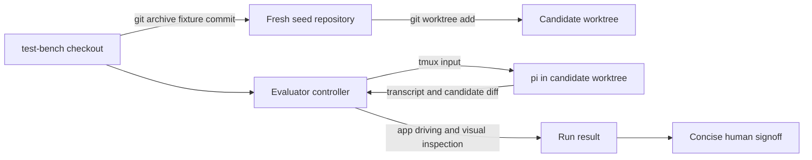

# Agent Eval Plan

## Purpose

Build a lean evaluator sidecar for repeatable coding-agent evaluations. The evaluator controls `pi`, verifies the running app, scores the outcome, and asks a human to confirm only the observations that materially affect the score.

The first fixture is commit `5fc7e04`, the shared starting point for the original local-model experiments. The report, notes, and screenshots in [`archive/local-model-field-test/`](archive/local-model-field-test/) are reference material, not part of the candidate workspace or the scoring oracle.

## Constraints

- Keep `test-bench` independent of later product development. Do not merge `main` into it.
- Pin every task to an explicit fixture commit and verbatim initial prompt.
- Let the supervisor adapt after the initial prompt: inspect progress, redirect, request evidence, recover from tool failures, and stop the run.
- Record every supervisor intervention verbatim and classify it.
- Never expose prompts, rubrics, reference evidence, assertions, or prior results to the candidate.
- Score both final quality and supervisory effort.
- Require live-app and visual inspection where the task changes runtime behavior or UI.
- Keep generated runs disposable and out of Git.

## Isolation Model

A normal worktree from this repository is insufficient because the candidate could inspect the `test-bench` branch through shared Git metadata. Each run instead starts from an exported fixture in a fresh repository.



The runner creates the seed repository from `git archive <fixture_commit>`, commits that snapshot as its only baseline, and creates the candidate worktree from it. Evaluator files remain in the `test-bench` checkout. Run output lives under `.tmp/evals/<run-id>/`; the candidate receives no evaluator paths in its prompt or environment.

Before implementation, prove that the chosen process sandbox prevents `pi` from reading the evaluator checkout or sibling run directories. Treat failed isolation as a blocker, not a warning.

## Proposed Layout

```text
evals/
  plan.md                implementation plan
  archive/               original field-test material for reference
  tasks/                 public task manifests and verbatim prompts
  private/               hidden rubrics, assertions, reference evidence
  schemas/               run result and score schemas
  runner/                fixture export, process control, artifact capture
  supervisor/            evaluator-agent skill and stopping policy
.tmp/evals/<run-id>/     disposable candidate, transcript, evidence, result
```

Keep the first implementation narrower if some directories would contain only one file.

## Run Contract

Each task manifest defines:

- fixture commit and verbatim initial prompt
- supervisor model, instructions, tools, and budgets
- candidate model/runtime configuration
- deterministic checks and required runtime evidence
- hidden visual and behavioral rubric
- timeout, inactivity, recovery, and stopping rules

The supervisor runs `pi` interactively in `tmux`. Use `pipe-pane` for the durable transcript and `capture-pane` only for current-state inspection. Follow-ups are allowed, but each is classified as clarification, recovery, correction, verification request, or implementation guidance.

The run result records configuration, timings, token counters where available, transcript, interventions, candidate diff, command results, screenshots, evaluator observations, per-criterion scores, and final disposition. Infrastructure failures remain distinct from candidate failures.

## Scoring And Signoff

Use deterministic checks as the primary oracle for build, tests, static analysis, repository hygiene, and inspectable app state. The supervisor must independently open and inspect screenshots rather than accepting the candidate's claim that they prove success.

Score at least these dimensions:

- functional outcome
- runtime and visual correctness
- regression safety and code quality
- evidence quality and truthfulness
- autonomy cost: interventions, retries, elapsed time, and token use

The human signoff should show only score-changing observations: the relevant screenshot or state, the evaluator's claim, and approve/correct controls. Preserve corrections in the run result.

## Delivery Steps

1. Define one task manifest and result schema using the original Settings task.
2. Implement fixture export, fresh-repository creation, candidate worktree setup, and an isolation self-test.
3. Add `tmux` supervision with transcript capture, inactivity detection, budgets, and intervention logging.
4. Integrate deterministic Flutter checks and the existing app-driving tooling.
5. Add screenshot capture plus evaluator visual inspection and concise human signoff.
6. Replay the reference model once, then run repeated candidates to expose variance and tune only the evaluator policy.
7. Add the swipe-seek task after the Settings task is reproducible end to end.

## Acceptance Criteria

- Re-running a manifest recreates the same clean fixture without evaluator artifacts.
- The candidate cannot discover evaluator files through Git or filesystem access.
- A complete run can survive and document `pi` inactivity or process failure.
- Claims about live behavior link to captured state or visual evidence.
- The score can be reconstructed from stored checks, observations, and interventions.
- Human review is short and limited to observations that can change the result.