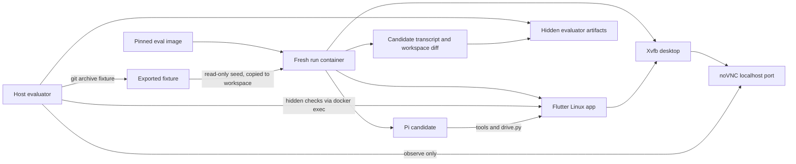

# Agent Evaluation Plan

## Goal

Build a repeatable environment for evaluating whether coding agents can change a real Flutter codebase and close the implementation loop through live-app observation, runtime state, screenshots, and corrective iteration. Each candidate works from the same historical source fixture, drives a real Flutter desktop app, and produces evidence that an evaluator can independently verify.

The evaluator measures task capability, not recovery from stale host state. Infrastructure failures invalidate a run instead of lowering the candidate's score.

The first calibration task is fixture `5fc7e04` with the verbatim prompt:

> Drive macOS app, smoke test play/pause, skip and fast forward

For container runs, replace only the platform word with `Linux`. Record this as a distinct task variant; do not silently compare Linux results with the archived macOS scores.

The original notes and screenshots in [`archive/local-model-field-test/`](archive/local-model-field-test/) are historical reference material. They are hidden from candidates and are not a scoring oracle.

## Task Suite

The initial suite contains seven tasks. T1 and T7 exercise app-driving and runtime evidence directly. T2-T6 require product code changes and live verification.

1. **Playback smoke:** drive the Linux app and verify play, pause, skip, and seek.
2. **Settings placement:** show cassette variants immediately below the cassette setting.
3. **Settings placement and rename:** retain the placement change and rename the color-changing variant setting to `color scheme`.
4. **Swipe-to-seek UI:** replace the center-screen seek indicator with position, time, and progress in the bottom folder line while swiping.
5. **Jump to now playing:** add a conditional affordance that opens or navigates the browser to the playing track and brings it into view.
6. **Dot song information:** add a default-off, persistent Dot-screen song-information option that respects text scaling.
7. **Opus shuffled playlist:** add all ten supplied Opus tracks to the playlist, enable shuffle, start playback, and prove the queue and active media are valid.

Task manifests hold the exact prompt and public requirements. Hidden references define deterministic assertions and visual criteria without prescribing implementation. Before freezing T2-T6, verify against fixture `5fc7e04` that the requested behavior is absent and the later known-good behavior can be reproduced on Linux.

## Lessons From Dry Runs

The initial macOS runner isolated source code but not runtime behavior. It exposed candidates to stale Flutter processes, inherited `DRIVE_*` variables, persistent Hive and queue state, host library state, and media paths the sandboxed app could not read. One Mini run primarily measured recovery from those evaluator-created problems and is therefore invalid as model evidence.

A direct Pi run and the archived run both showed that Mini can complete the playback task. The failed controlled run remains a harness postmortem, not a candidate score.

The Docker smoke test proved the replacement path:

- Flutter Linux builds and runs in an ARM64 Docker Desktop VM.
- Xvfb and noVNC expose the live app at a per-run browser URL.
- The existing `drive.py` harness reaches all 31 VM extensions.
- Container-local media supports play, pause, skip, and seek.
- App state, processes, environment variables, files, and media are disposable per run.
- The vendored Linux codec binaries are x86-64. ARM64 images must install native FLAC, Opus, Ogg, and Vorbis libraries and set `TRY_SYSTEM_LIBS_FIRST=1`.

## Principles

- Pin the fixture commit, task variant, initial prompt, image digest, model, provider, thinking level, and resource limits.
- Give every candidate an equivalent fresh environment.
- Keep evaluator prompts, rubrics, prior results, and hidden assertions outside the container.
- Let the candidate own task execution. The runner owns infrastructure only.
- Observe through noVNC and evaluator APIs without changing candidate state.
- Record every human or supervisor message after the initial prompt as an intervention.
- Separate candidate failure, assisted completion, and invalid infrastructure runs.
- Preserve raw evidence so another evaluator can reconstruct the result.
- Treat one run as a sample. Use repeated runs before making model-level claims.

## Architecture



### Trust Boundary

The container receives only:

- the exported source fixture
- the candidate prompt
- the Pi runtime and candidate model credentials
- deterministic media fixtures
- explicitly allowed network access

It never receives:

- the host repository or its `.git` directory
- `evals/private`, archived reports, scores, or reference screenshots
- sibling run directories
- the Docker socket
- host SSH, cloud, Git, or package-manager credentials
- writable artifact storage outside its own run directory

The host evaluator may inspect the container, VM service, logs, and display. Evaluator observations must be read-only until the candidate finishes or an intervention is deliberately recorded.

## Evaluation Image

The image contains environment dependencies, not candidate source:

- pinned Flutter and Dart SDK
- Linux build tools and GTK development packages
- Xvfb, Openbox, x11vnc, and noVNC
- PulseAudio or an equivalent virtual audio backend
- Python, `websockets`, `uv`, and Pi prerequisites
- `ffmpeg` for deterministic media generation
- native system FLAC, Opus, Ogg, and Vorbis libraries
- `TRY_SYSTEM_LIBS_FIRST=1`

Build and publish the image by immutable digest for both `linux/arm64` and `linux/amd64` when both hosts are needed. Do not copy architecture-specific codec binaries into the candidate repository.

The image build must run a generic Linux desktop/toolchain self-test. It must not compile the task fixture or create candidate build output. Decide and record one cache policy for scored comparisons:

- **Cold candidate build:** fresh source, `.dart_tool`, and `build`; SDK and package download caches may be image-pinned.
- **Warm candidate build:** only if every candidate receives an identical prebuilt cache keyed by fixture and image digest.

Start with cold candidate builds because they are easier to audit.

## Run Lifecycle

### 1. Prepare

1. Resolve the task manifest and image digest.
2. Export the fixture with `git archive <commit>` into a temporary seed directory.
3. Initialize the exported snapshot as a fresh Git repository with one baseline commit.
4. Create an empty host artifact directory owned by the evaluator.
5. Select unique localhost ports and a unique run ID.
6. Generate or copy deterministic media into the container-visible fixture area.

The candidate workspace is a writable copy of the seed. The seed remains read-only so the evaluator can verify provenance.

### 2. Preflight Infrastructure

Before sending the prompt, verify:

- the container matches the expected image digest and architecture
- Xvfb, window manager, VNC, and noVNC are healthy
- the noVNC URL returns HTTP 200
- the workspace baseline is clean and matches the fixture tree
- media files exist, are readable, and have expected durations and hashes
- no Flutter app, Dart VM service, stale FIFO, or prior `DRIVE_*` state exists
- app configuration and data directories are empty
- required candidate API endpoints are reachable
- CPU, memory, disk, timeout, and process limits match the manifest

Do not start the Nothingness app when launching it is part of the task. Starting duplicate apps, choosing the wrong target, or mishandling sidecars after a clean preflight is then candidate behavior rather than harness contamination.

### 3. Run Candidate

Start Pi in the candidate workspace with the verbatim prompt. Use structured JSONL output as the canonical transcript. Terminal capture is for live supervision only.

The candidate may:

- inspect and modify its workspace
- run Flutter and repository tools
- create media inside the container
- launch and drive the Linux desktop app
- access only the network destinations allowed by the task policy

The runner records process creation, resource use, model/API errors, and noVNC availability without injecting messages.

### 4. Observe

Assign each run a URL such as:

```text
http://localhost:<port>/vnc.html?autoconnect=true&resize=scale
```

Human mouse or keyboard input through noVNC changes the run and must be logged as an intervention. Passive viewing is not an intervention.

The evaluator captures compact state independently. Avoid full `inspect` output when only playback fields are relevant. Add or use narrow read-only views for:

- process and VM identity
- current track path and queue index
- `isPlaying`, position, and duration
- queue `isNotFound` values
- overflow and runtime error counts
- screenshot capture

Keep full `inspect` available to the candidate for compatibility, but do not make large library dumps the evaluator's default evidence path.

### 5. Finish And Verify

When Pi exits, reaches a stopping limit, or is stopped by the supervisor:

1. Freeze candidate input.
2. Capture final JSONL, stdout/stderr, Flutter log, process metadata, and resource usage.
3. Capture Git status, diff, and untracked files.
4. Run hidden deterministic checks from the evaluator side.
5. Capture compact runtime state and screenshots before stopping the app.
6. Record interventions and infrastructure incidents.
7. Classify run validity before scoring.
8. Copy artifacts out, stop the container, and delete its writable filesystem.

## Candidate Media Contract

Media must never depend on host application permissions or mounted personal libraries. The image includes ten deterministic Opus tracks under one discoverable library folder. Tracks have distinct filenames, embedded metadata, frequencies, and sufficient duration for seeking. Their generation recipe, expected hashes, durations, and metadata are version controlled; generated binaries live in the image rather than Git.

The paths may be discoverable through normal filesystem inspection, but the task prompt should not reveal them unless media discovery is outside the capability being tested. Candidate-created files inside the workspace are also readable by the app.

Every run starts with empty application data and no active playlist. Do not seed persistent queue, shuffle, or playback state globally. T7 requires the candidate to add the supplied files; other tasks may use the same tracks without inheriting T7 state.

The evaluator verifies media hashes and durations before the prompt. A candidate choosing a nonexistent path is a candidate error. A preflight-approved media file becoming unreadable without candidate action is an infrastructure failure.

For T7, the hidden runtime oracle requires:

- playlist length is 10
- every expected media hash/path is represented exactly once
- every queue item has `isNotFound == false`
- shuffle mode is enabled
- `isPlaying == true`
- current track and duration identify one of the supplied Opus files
- at least one post-shuffle navigation transition remains within the ten-track set

Do not assert one exact shuffled order. Shuffle is stochastic, and a valid run must not fail because it produced a particular permutation.

## Network And Secrets

Run without the Docker socket and with all Linux capabilities dropped unless the app requires a documented exception. Bind noVNC to `127.0.0.1` only.

The candidate model needs network access, so `--network=none` is not generally possible. Use an egress proxy or allowlist for model-provider endpoints. Package network policy must be explicit:

- preferred: dependencies are pinned and cached in the image, with package registries blocked during scored runs
- allowed exception: a task manifest may permit package registries when dependency work is part of the task

Inject only short-lived candidate API credentials. Redact them from process dumps and artifacts. Never mount host credential directories.

## Intervention Policy

The initial prompt is not an intervention. Every later candidate-facing message is recorded verbatim with timestamp and one classification:

- **clarification:** resolves genuine prompt ambiguity without giving a solution
- **recovery:** continues after a provider, Pi, or terminal transport interruption
- **verification request:** asks for evidence without naming the missing implementation step
- **correction:** redirects an incorrect approach or unsupported claim
- **implementation guidance:** provides a concrete method, file, command, or solution step

Report both the unassisted outcome and the final assisted outcome. Never relabel an assisted pass as unassisted. Infrastructure repair performed outside the candidate channel is logged separately and normally invalidates the run if it changes candidate conditions.

## Run Validity

Classify validity before assigning a task score.

### Valid

- preflight passed
- candidate received the intended prompt, fixture, model, and limits
- infrastructure stayed within the declared contract
- evidence and transcript are complete enough to reconstruct the outcome

### Invalid: Infrastructure

Examples:

- stale pre-run app, VM, queue, Hive, or sidecar state
- wrong fixture, image, model, prompt, or platform variant
- noVNC, Xvfb, audio backend, Docker, disk, or evaluator failure
- preflight-approved media is inaccessible because of the environment
- provider outage or throttling beyond the manifest's retry policy
- missing or corrupted canonical transcript
- hidden evaluator action changed candidate-visible state without being part of the protocol

Invalid runs are retained for harness diagnosis but excluded from model scores.

### Candidate Failure

After a clean preflight, these remain candidate behavior:

- launching the wrong platform or duplicate apps
- failing to discover or use readable media
- leaving commands hanging or entering reasoning loops
- modifying unrelated files
- reporting success without supporting state
- failing build, tests, runtime behavior, or visual requirements

## Scoring

Use the existing ordinal outcome scale for continuity:

- **3 Good:** complete, correct, independently verified
- **2 Average:** core task correct with meaningful omissions or limited assistance
- **1 Bad:** partial or substantially flawed result
- **0 Fail:** task not completed or result unusable

Record separate dimensions before deriving the ordinal score:

- functional result
- live runtime behavior
- visual correctness when applicable
- regression safety and repository hygiene
- evidence accuracy and truthfulness
- autonomy: intervention count and type

Report efficiency separately rather than folding it invisibly into correctness:

- elapsed wall time
- assistant turns and tool calls
- input, output, reasoning, cache-read, and cache-write tokens
- provider cost
- peak CPU and memory
- retries and provider errors

Do not compare cost or latency across providers without noting different pricing, throttling, cache accounting, and local-versus-hosted execution.

## Repetition And Comparison

One run demonstrates possibility, not reliability. Run three valid trials for every model/task pair on the same task variant and image digest. Score each trial independently before examining the other two. Randomize model order when provider conditions may drift.

After all three trials, investigate variance and produce one consolidated task evaluation. Preserve the score vector, for example `[3, 3, 1]`; report median and range rather than hiding disagreement in an average. Explain whether variance came from candidate behavior, provider instability, assistance, or an environment incident. Invalid infrastructure trials are retained but replaced until three valid trials exist.

Each consolidated task result reports:

- three independent trial scores and validity classifications
- median, range, and unassisted/assisted pass rates
- recurring strengths, failures, and evidence-quality issues
- material variance and its likely cause
- a stability label: `stable`, `mixed`, or `inconclusive`

After isolated task trials are established, run a separate cumulative track in which all tasks are issued one at a time in a single Pi session and evolving workspace. Score each checkpoint independently and report context growth, compaction, regression accumulation, and completion depth. Never mix cumulative-session results into the isolated task score.

Compare:

- unassisted pass rate
- assisted pass rate by intervention severity
- invalid-run rate
- median score and score distribution
- median time, tokens, and cost
- evidence-truthfulness failures

Archived macOS results remain a separate cohort. Use them as qualitative context until the same model/task has enough Docker/Linux repetitions to establish a new baseline.

## Version-Controlled Results

Evaluation results are a primary branch deliverable. Keep scored results under `evals/results/` on `test-bench`; use `.tmp/evals/<run-id>/` only as staging while a run is active. Review and redact staged artifacts before promoting them into Git.

```text
evals/results/<model-id>/
  README.md                       consolidated model report
  <task-id>/
    consolidated.md              three-trial synthesis and variance
    trial-1/
      result.json
      manifest.json
      interventions.json
      candidate.diff
      evidence/
    trial-2/
    trial-3/
```

The model report leads with task score vectors, stability, pass rates, cost/time summaries, cumulative-session findings, and links to evidence. Individual trials retain the resolved configuration, score, compact evidence, candidate diff, and intervention record.

Canonical Pi JSONL, Flutter logs, process timelines, and command outputs are valuable audit evidence but may be large. Store compressed raw artifacts when practical; use Git LFS if branch growth becomes material. Never commit secrets, provider caches, container filesystems, build output, or redundant full-library state dumps.

The result schema must distinguish `valid`, `invalid_infrastructure`, `unassisted_pass`, `assisted_pass`, and `candidate_fail` without inferring one from the numeric score alone.

## Evaluator Skill

Deliver the evaluator as a structured Agent Skill under the repository's standard skill discovery path, using progressive disclosure:

```text
.agents/skills/nothingness-evals/
  SKILL.md                         concise operator workflow
  references/
    architecture.md               trust boundary and container model
    run-protocol.md               lifecycle, validity, interventions
    scoring.md                    trial and consolidation rules
    task-authoring.md              public manifests and hidden oracles
    troubleshooting.md            infrastructure-only recovery
  scripts/
    build-image
    prepare-run
    preflight
    launch
    observe
    collect
    consolidate
    cleanup
```

`SKILL.md` stays procedural and below the recommended context budget. It links to references only when the operator reaches that phase. Scripts produce structured JSON, use stable exit codes, and avoid requiring the supervising agent to reconstruct state from terminal prose.

The skill is canonical in `.agents/skills/nothingness-evals/`; do not duplicate it under `evals/`. The results-oriented `evals/README.md` links to the skill for operating and reproducing evaluations.

## Proposed Repository Layout

```text
evals/
  README.md                orientation and latest result index
  plan.md
  archive/                historical field tests
  image/                  Dockerfile, entrypoint, locked image inputs
  tasks/                  public task manifests and prompts
  private/                hidden rubrics and assertions; never mounted
  schemas/                manifest and result schemas
  results/                version-controlled trials and model reports

.agents/skills/
  nothingness-evals/      evaluator skill, references, bundled scripts
```

Create directories only when the first real file is needed.

## Delivery Plan

1. Create the results-first `evals/README.md` and the evaluator skill skeleton with references and script contracts.
2. Promote the working `.tmp/docker-smoke` prototype into `evals/image` and pin the Flutter base image by digest.
3. Add deterministic generation and validation for ten Opus fixtures plus native codec dependencies for ARM64 and AMD64.
4. Add a container entrypoint with health endpoints for Xvfb, noVNC, audio, media, and workspace state. Do not auto-launch the app.
5. Define all seven Linux task manifests, hidden assertions, limits, and invalidation policies.
6. Implement fixture export, fresh baseline repository creation, unique ports, container launch, collection, and cleanup as skill scripts.
7. Run an isolation self-test proving the candidate cannot read the host checkout, evaluator files, sibling runs, Docker socket, or host credentials.
8. Integrate Pi JSONL capture, model metadata, token/cost extraction, timeout handling, and intervention logging.
9. Add compact evaluator playback/overflow/screenshot collection and preserve raw evidence.
10. Run T1 and T7 with a known-capable model as harness validation. Fix infrastructure defects without scoring those runs.
11. Freeze image and manifest digests, then collect three valid trials per model/task pair.
12. Consolidate each task, investigate variance, and publish the per-model report before running the cumulative-session track.

## Acceptance Criteria

- A manifest recreates the same fixture, image, media, limits, and initial prompt.
- Ten expected Opus fixtures pass hash, metadata, duration, decode, and runtime-readability checks.
- The candidate cannot discover evaluator or host files outside its declared inputs.
- Every scored run begins with empty app/process state and a passing infrastructure preflight.
- The app can be watched live through a unique localhost noVNC URL.
- Candidate-created and supplied media are readable by the Linux app.
- Runtime claims link to compact captured state or screenshot evidence.
- Every post-prompt message and evaluator-side state mutation is auditable.
- Infrastructure failures are excluded from candidate scores.
- Every model/task result contains three independently scored valid trials and a consolidated variance report.
- `evals/README.md` links to current per-model reports and explains how to reproduce a run.
- The container and writable filesystem are removed after artifact extraction.
- Another evaluator can reconstruct validity and score from retained artifacts alone.