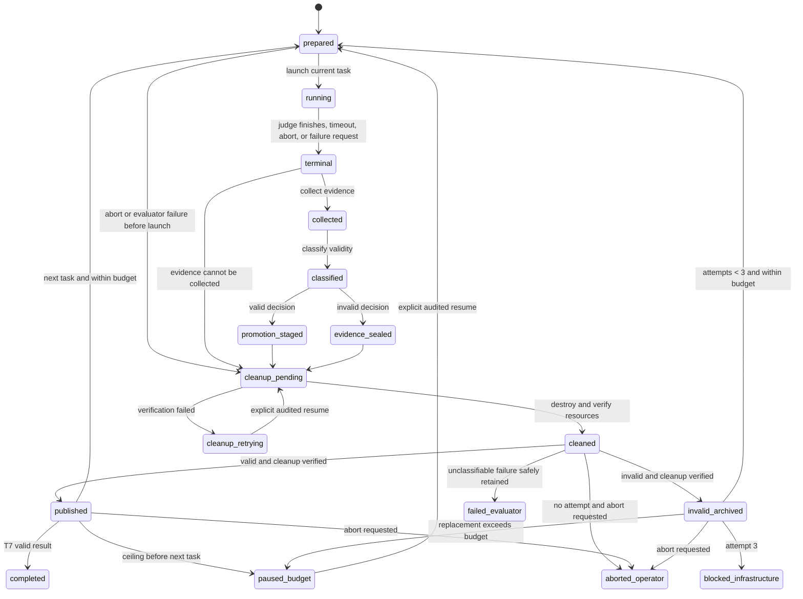

# Next Nothingness Evaluator Campaign

**Status: implementation required; next scored campaign is blocked until release gates pass.**

## Scope And Current Standing

The next run is one sequential campaign with exactly one scored, isolated trial for each of T1 through T7. It is not a cumulative Pi session and not the later reliability cohort of three trials per task (21 valid trials). Each task starts in a fresh container, workspace, application-data directory, process set, and app state. Task containers never overlap.

Current infrastructure is pinned to image `nothingness-eval:t1` digest `sha256:bb08b8fde7f78c251fc540ab9eca5d6f32c7422b0cfc58ca78d0b941e9caacd9`, fixture `5fc7e04`, Flutter 3.44.0 / Dart 3.12.0, ten immutable Opus fixtures, and the exact-host proxy. Offline and runtime baselines are `verify-offline-baseline.py` and `verify-runtime-baseline.py`. The existing primitive lifecycle is one `judge-run.py` task/trial, `watch-eval.py`, collect/classify/cleanup, and a single-run active judge. Tests: 37 passing. `classify-run.py` now conclusively reports `runtime unavailable` for a requested persisted runtime inspection; evaluator tests pass.

One promoted result exists: `evals/results/gpt-5.4-nano/t1-playback-smoke-linux/trial-1/result.json`. It is a valid `candidate_fail`, score 0, one correction, model `gpt-5.4-nano` at medium, 535,839 candidate tokens, and combined cost `$0.02561524`. It is only T1 trial 1 of 3, not a model-level conclusion, and is not reused as this campaign's T1 trial because this is a newly frozen seven-task cohort and contract.

Only `evals/tasks/t1-playback-smoke-linux.json` and `evals/suites/t1-gpt-5-4-nano-medium.json` exist today. There is no `evals/private` directory. T1 is the only deterministic oracle in `collect.py`; `watch-eval.py` is run-scoped; `consolidate.py` only emits JSON for three valid same-task trials; promotion/reporting are manual. The target is a reviewed, auditable campaign controller plus all seven frozen task contracts.

## Campaign Contract

Model path ID preserves the configured model ID exactly except `/` is replaced with `--`; `gpt-5.4-nano` therefore remains `gpt-5.4-nano`. Campaign ID is `<model-path-id>--<suite-id>--<YYYYMMDDTHHMMSSZ>`, where `suite-id` is the exact committed suite `id`, not a filename abbreviation. Example: `gpt-5.4-nano--t1-t7-gpt-5.4-nano-medium--20260717T000000Z`. The ID and normalization inputs are immutable in campaign state. The frozen suite declares exactly T1-T7 and the public prompt/manifests, fixture, image digest, model/provider/thinking, limits, proxy policy, and task ordering.

| Rule | Decision |
| --- | --- |
| Unit of work | One scored isolated trial per T1-T7, in order, sequentially. |
| Advance condition | Advance after any valid terminal result, including `candidate_fail`. |
| Invalid attempt | Retain its artifacts, collect/classify/seal them in campaign staging, then clean and replace the same task. Invalid evidence never enters the scored results tree. |
| Retry cap | Two replacements, three total attempts per task. Exhaustion is `blocked_infrastructure` and stops the campaign. |
| Serialization | Do not start the next attempt until the current attempt is terminal, collected, classified, promotion-staged or invalid-evidence-sealed, and cleaned. A valid attempt must also be published before the next task starts. |
| Scoring | Only the active AI judge decides score/outcome after inspecting complete events, runtime, Git, process, and intervention evidence. The controller never scores. |
| Budget | Default candidate-plus-admission ceiling: `$1.00`; token ceiling: `5,000,000`. Before each new attempt, pause if either is reached. If any required cost component is `unknown`, pause because the monetary ceiling cannot be proven; resume requires an explicit logged `--allow-unknown-cost`. Never kill an active task only for budget; its timeout still applies. An operator may raise a ceiling only explicitly before resume. |

Campaign stop/status outcomes are exactly the following. `completed`, `blocked_infrastructure`, `aborted_operator`, and `failed_evaluator` are immutable terminal states. `paused_budget` is the sole intentional resumable campaign status: the dashboard remains attached, no candidate resources exist, and only an explicit audited `resume` can return it to `prepared`. `cleanup_retrying` is an internal safety phase, not a campaign outcome; it exists only while resource absence remains unverified.

- `completed`: seven valid task results; candidate failures remain task outcomes.
- `blocked_infrastructure`: replacement cap exhausted or a non-recoverable evaluator prerequisite failed.
- `paused_budget`: a ceiling is reached before a new task begins.
- `aborted_operator`: explicit operator abort after the active attempt completes the classification, cleanup, and publication/archive barrier.
- `failed_evaluator`: controller/schema/security/release integrity failure that invalidates continuation.


```mermaid
stateDiagram-v2
  [*] --> prepared
  prepared --> running: launch current task
  prepared --> cleanup_pending: abort or evaluator failure before launch
  running --> terminal: judge finishes, timeout, abort, or failure request
  terminal --> collected: collect evidence
  terminal --> cleanup_pending: evidence cannot be collected
  collected --> classified: classify validity
  classified --> promotion_staged: valid decision
  classified --> evidence_sealed: invalid decision
  promotion_staged --> cleanup_pending
  evidence_sealed --> cleanup_pending
  cleanup_pending --> cleaned: destroy and verify resources
  cleanup_pending --> cleanup_retrying: verification failed
  cleanup_retrying --> cleanup_pending: explicit audited resume
  cleaned --> published: valid and cleanup verified
  cleaned --> invalid_archived: invalid and cleanup verified
  cleaned --> aborted_operator: no attempt and abort requested
  cleaned --> failed_evaluator: unclassifiable failure safely retained
  published --> prepared: next task and within budget
  published --> completed: T7 valid result
  published --> paused_budget: ceiling before next task
  published --> aborted_operator: abort requested
  invalid_archived --> prepared: attempts < 3 and within budget
  invalid_archived --> blocked_infrastructure: attempt 3
  invalid_archived --> paused_budget: replacement exceeds budget
  invalid_archived --> aborted_operator: abort requested
  paused_budget --> prepared: explicit audited resume
```

An abort or failure requested while an attempt is active only records the requested terminal status; the attempt still follows the full barrier through cleanup and publication or invalid archive when evidence remains classifiable. If collection or classification is impossible, it follows `terminal -> cleanup_pending -> cleaned -> failed_evaluator` and retains a failure record plus all recoverable evidence. A staged valid decision may say `valid` before cleanup, matching the existing classifier contract, but it is not publishable and cannot advance or complete the campaign until `cleanup.json` passes. No transition to an immutable terminal status may retain a container, process, port, or writable candidate workspace.

Cleanup verification gets three automatic attempts with the attempt count, command output, and remaining resources appended to `cleanup.jsonl`. After the third failure, the controller remains in nonterminal `cleanup_retrying`, exits nonzero, keeps the dashboard attached, and refuses every action except read-only status, operator abort request, and `resume`. `resume` first restores the Docker/control dependency if needed and reruns idempotent forced cleanup plus independent container, network, process, port, mount, and workspace absence checks. It cannot launch, publish, archive, advance, or enter an immutable terminal status until verification succeeds. Once verified, the lifecycle returns through `cleaned` and honors the previously requested terminal status; cleanup exhaustion therefore cannot be hidden or mistaken for a completed campaign.

## Task Suite And Frozen Contracts

Freeze exact public prompts and manifests before any scored run. Public manifests state desired behavior, environment, limits, and allowed tools; they do not name candidate implementation files. Hidden contracts live under `evals/private/oracles/<task-id>.json`; host implementations live under `.agents/skills/nothingness-evals/scripts/oracles/`, with tests under `test/evals/oracles/`. None of these paths is mounted or copied into candidate containers. Public manifests name required evidence captures and task timeout but do not expose hidden assertions. The frozen suite records evaluator-side oracle hashes alongside fixture/image fingerprints.

| ID | Public task | Deterministic evaluator contract |
| --- | --- | --- |
| T1 | Playback smoke: drive Linux app; prove play, pause, skip, seek. | Runtime state proves a valid supplied track, transitions `isPlaying` true/false/true, track/index changes, and position advances then changes by seek. Compact screenshots show the active UI. |
| T2 | Settings placement: cassette variants immediately below cassette setting. | Semantic/settings-tree order places all cassette variants as contiguous immediate following siblings. Screenshot shows the relevant scrolled settings region without unrelated settings between. |
| T3 | T2 placement plus rename color-changing variant setting to `color scheme`. | T2 order oracle passes; semantic text exposes `color scheme` and not the previous public label; screenshot captures the setting and adjacent variants. |
| T4 | Swipe-to-seek UI: while swiping, position/time/progress in bottom folder line; remove center indicator. | Synthesized drag produces runtime seek progression; screenshot during gesture shows position, time, and progress in bottom folder line and no center seek indicator. Screenshot after gesture checks transient state clears. |
| T5 | Jump to now playing: conditional affordance navigates browser to current track and scrolls it into view, including when the browser is already in the playing track's folder. | With the playing track off-screen in the current browser folder, the affordance is semantically discoverable and activating it keeps the browser in that folder while making the current track visible and focused/located in scroll bounds. When no playing track exists, the affordance is absent or disabled per frozen manifest. |
| T6 | Harden Dot song information at maximum text size: preserve the existing default-off persistent option while long artist/title text remains readable without clipping or intersecting the pulsing dot. | Fresh data is default off; toggle survives app restart; Dot changes only when enabled. At frozen normal and maximum `1.5` text scales with long metadata, semantic text is present and measured text bounds remain inside the hero without intersecting the measured dot bounds. |
| T7 | Opus shuffled playlist: ten immutable tracks once each, shuffle on, playing valid media, post-shuffle transition remains in set. | Hash/path inventory has exactly the expected ten fixtures once each; all queue entries are found; shuffle is enabled; valid supplied media is playing; after one navigation transition current media remains in set. Do not require a shuffled order. |

For T2-T6, before freeze QA records both: (1) behavior absent on fixture `5fc7e04`; and (2) positive known-good Linux reproduction. T1 and T7 also validate fixture media/runtime substrate. Check implementations use semantic/state APIs first; screenshots are mandatory where the task has a visual placement, gesture, or scaled-text requirement. Each hidden oracle has positive, negative, and boundary fixtures so a merely plausible screenshot cannot pass.

## New Controller, State, And Dashboard

Implement `.agents/skills/nothingness-evals/scripts/campaign-run.py` as the sequential orchestrator and `.agents/skills/nothingness-evals/scripts/watch-campaign.py` as the campaign dashboard. Keep `judge-run.py` as the per-task/trial primitive. The controller owns lifecycle state, locks, budgets, retries, handoff scheduling, and transitions; it delegates candidate execution and the active judge lifecycle to the primitive. The active AI judge must inspect final event transcript, compact and complete runtime evidence, Git diff/status, process logs, intervention record, then finish, collect, decide, and cleanup through the existing contracts.

State path: `.tmp/evals/campaigns/<campaign-id>/campaign-state.json`. Use atomic write-rename and a lock file; every transition appends an event with UTC timestamp, prior/new phase, actor, reason, and fingerprints. Resume verifies state schema, suite hash, image digest, fixture, model, and no concurrent active container before acting. Mismatch is `failed_evaluator`, not a best-effort continuation.

`watch-campaign.py --campaign <id> [--refresh 2]` remains open across task transitions and `paused_budget`; it exits only for an immutable terminal state. `--once` prints one snapshot and exits. Refresh defaults to two seconds; Ctrl-C detaches the watcher without changing campaign state. Read-only keys may refresh, toggle expanded rows, or detach; candidate-facing control stays exclusively in `judge-control.py`.

Dashboard contract:

- Header: campaign ID, active task `n/7`, task ID, attempt/trial, phase, elapsed and task timeout, noVNC URL, last activity age, and cleanup state.
- Active row: tools/events count, retries `0..2`, candidate/admission/combined tokens and costs, intervention count/classes/delivery, and runtime availability.
- Per-task rows: queued/running/terminal outcome, attempts, validity, elapsed, tokens/costs, promotion and cleanup status.
- Footer: campaign totals, invalid-attempt count, budget ceilings and consumed totals, terminal reason if present.
- Unknown cost is displayed literally as `unknown`; never infer a cost. Do not show a fake candidate completion percentage.

## Artifacts, Reports, Publication, And Security

Canonical JSON stays canonical. Attempt artifacts live at `.tmp/evals/campaigns/<campaign-id>/tasks/<task-id>/attempt-<1..3>/`. Campaign results deliberately use `evals/results/<model-path-id>/campaigns/<campaign-id>/<task-id>/trial-1/`. The existing `evals/results/<model-path-id>/<task-id>/trial-N/` layout remains reserved for three-trial reliability cohorts, so campaign T1 cannot collide with the current T1 trial 1. Invalid attempts are digest-sealed in staging, then archived after cleanup under `evals/archive/evaluator-attempts/<campaign-id>/<task-id>/attempt-N/`; they never enter `evals/results/` or count as candidate scores.

For a valid attempt, publication first stages and validates a sibling temporary directory while the runtime still exists. Cleanup then destroys candidate resources and writes `cleanup.json`. Publication adds the cleanup digest, reruns schema/hash/redaction validation, atomically renames the staged directory into `evals/results/`, and records the path in campaign state. A staged decision can be `valid`; only a cleanup-verified published result can advance a task or complete the campaign.

Every attempt contains at minimum:

| Artifact | Requirement |
| --- | --- |
| `result.json` | Canonical task outcome, validity, score/decision, retries, model/provider, prompts/manifests hashes, limits, timestamps, and fingerprint references. |
| `report.md` | Human-readable outcome rationale, intervention summary, tokens/cost/time, repo/runtime evidence, compact-evidence links, and cleanup result. |
| `evidence/` | Readable compact state, screenshots, Git summary/diff metadata, process summary, oracle result, and redaction scan. Raw transcript/events may be `.jsonl.gz`. |
| `fingerprint.json` | Image digest, fixture commit/tree hash, Flutter/Dart, host/architecture, proxy policy, Opus manifest hashes, suite/manifest/oracle hashes, controller version, and command lines. |

The published campaign root also contains `campaign.md`, a human-readable table of all T1-T7 attempts, outcomes/rationales, totals, invalid attempts, budget decision, links to each valid trial report, and links to archived invalid-attempt reports. No reviewer should need to open or decompress raw JSONL. After successful reviewed publication, automatically update `evals/README.md` and the target model README index with campaign ID, suite hash, result table, report path, and explicit non-conclusion scope. JSON remains the source of truth.

Before collection, publication staging, invalid archival, and final publication, scan artifacts for provider credentials, proxy credentials, host paths outside approved evidence, and hidden-oracle/prompt leakage. Any publication, archival, schema, hash, index, or redaction failure records its evidence, removes any uncommitted temporary destination, completes verified cleanup, and then enters immutable `failed_evaluator`; it is never reclassified as `blocked_infrastructure` and never leaves a partial index update. Cleanup verifies container removal, workspace deletion, no running app/Pi/sidecar processes, released ports, and no writable mount outside attempt storage. Preserve only approved copied evidence and hashes.

## Terra Work Packets And QA

Terra work is independent and stateless. A packet receives only its prompt, owned files, frozen interfaces, and acceptance tests. The coordinator integrates shared files and serializes changes; no concurrent overlapping edits. Terra agents never judge their own output.

| Packet | Owner files | Deliverable and dependency |
| --- | --- | --- |
| P1 contracts/oracles T2/T3 | distinct task manifests, private contracts, oracle implementations/tests | Frozen settings semantic/visual contracts; requires fixture absence and known-good proof. |
| P2 contracts/oracles T4/T5 | distinct files in the same task/oracle/test roots | Frozen gesture/navigation contracts; same proof requirement. |
| P3 contracts/oracles T6/T7 | distinct files in the same task/oracle/test roots and media checks | Frozen persistence/scaling and Opus contracts. |
| I1 suite/oracle integration | coordinator-owned suite manifest and shared oracle registry | Runs after P1-P3; creates `evals/suites/t1-t7-gpt-5.4-nano-medium.json` with exact ID `t1-t7-gpt-5.4-nano-medium`. Terra packets do not concurrently edit shared files. |
| P4 campaign schema/orchestrator | `campaign-run.py`, state/schema tests | Depends on common manifest contract and existing primitive lifecycle. |
| P5 dashboard | `watch-campaign.py`, snapshot tests | Depends on P4 state schema only. |
| P6 reporting/publication | report/index/publication and invalid-archive code/tests | Depends on P4 artifact schema; owns generated Markdown shape. |
| P7 dry-run/release execution | test fixtures and release checklist only | Depends on P1-P6 integration; no scored provider call. |

After every packet, the default `qa` agent gets a self-contained handoff following `.agents/skills/qa-handoff`: conversation story, changed files, actual command output, happy/negative/corner matrix, requirement traceability, and independent runtime evidence when a harness exists. QA has no implementation conversation history, gives PASS/FAIL, and can require up to three repair/review rounds; ambiguity is FAIL. Final release uses `qa-1` and `qa-2` in parallel on the same package and same round. Both must PASS; a disagreement or failure enters the next round, maximum three.

## Implementation Stages And Gates

1. Freeze public T1-T7 manifests, hidden evaluator contracts, hashes, T2-T6 absence proof, and known-good Linux proof. Gate: oracle unit/contract tests cover positive, negative, and boundary cases.
2. Implement P4 state machine, serialization, retry/budget/cleanup barriers, resume validation, and controller tests. Gate: synthetic failures demonstrate no overlap, no skipped task, and cap behavior.
3. Implement P5 dashboard and P6 reports/publication/archive/index updates. Gate: fixture state snapshots exercise `--once`, refresh, unknown cost, all terminal states, readable Markdown, atomic-publication failure recovery, and invalid-archive isolation.
4. Integrate P7. Gate: evaluator unit/contract tests, `verify-offline-baseline.py`, `verify-runtime-baseline.py`, and a non-billable/no-provider synthetic campaign state/dashboard/report test all pass. Use fakes/fixtures for orchestration and reports; do not run a seven-task model dry run. Use the real zero-credential runtime baseline for app substrate.
5. Complete final parallel QA release gate. Only then run the first scored campaign.

## Operator Runbook

Commands are shapes for the implementation. Run from repository root with a frozen suite and explicit limits:

```sh
# Validate release prerequisites and frozen suite before any provider request.
uv run python .agents/skills/nothingness-evals/scripts/campaign-run.py validate \
  --suite evals/suites/t1-t7-gpt-5.4-nano-medium.json

# Start the one-trial-per-task campaign.
uv run python .agents/skills/nothingness-evals/scripts/campaign-run.py start \
  --suite evals/suites/t1-t7-gpt-5.4-nano-medium.json \
  --campaign-id gpt-5.4-nano--t1-t7-gpt-5.4-nano-medium--20260717T000000Z \
  --candidate-admission-cost-ceiling-usd 1.00 \
  --token-ceiling 5000000

# Observe without changing candidate state.
uv run python .agents/skills/nothingness-evals/scripts/watch-campaign.py \
  --campaign gpt-5.4-nano--t1-t7-gpt-5.4-nano-medium--20260717T000000Z --refresh 2
uv run python .agents/skills/nothingness-evals/scripts/watch-campaign.py \
  --campaign gpt-5.4-nano--t1-t7-gpt-5.4-nano-medium--20260717T000000Z --once

# Resume only after inspecting state; raising a budget is explicit and logged.
uv run python .agents/skills/nothingness-evals/scripts/campaign-run.py resume \
  --campaign <campaign-id>
uv run python .agents/skills/nothingness-evals/scripts/campaign-run.py resume \
  --campaign <campaign-id> \
  --candidate-admission-cost-ceiling-usd 1.50 --token-ceiling 6000000
uv run python .agents/skills/nothingness-evals/scripts/campaign-run.py resume \
  --campaign <campaign-id> --allow-unknown-cost

# Per-attempt active supervision uses the existing judge lifecycle tools.
uv run python .agents/skills/nothingness-evals/scripts/judge-events.py \
  <run-id> --after <sequence>
uv run python .agents/skills/nothingness-evals/scripts/judge-inspect.py \
  <run-id> --runtime --git --processes
uv run python .agents/skills/nothingness-evals/scripts/judge-control.py \
  <run-id> follow-up --class correction --message '<text>' --reason '<reason>'

# Inspect final human report and canonical state.
uv run python .agents/skills/nothingness-evals/scripts/campaign-run.py report \
  --campaign <campaign-id>
```

The controller performs launch, supervise, terminal detection, collect, judge decision, classify, publication staging or invalid-evidence sealing, cleanup, valid-result publication or invalid-attempt archival, then transition. On host/controller interruption, start the watcher with `--once`, inspect lock/container/process state, and invoke `resume`; it must first complete or classify the recorded active attempt, never launch a duplicate. On a task timeout, the judge terminalizes it and the normal barrier follows. For `paused_budget`, review `campaign.md` and raise ceilings, explicitly accept unknown-cost continuation, or record `aborted_operator`. For infrastructure invalidity, archive sealed evidence and replace only within the cap. Never manually skip a task.

## Acceptance And Evidence Matrix

| Requirement | Acceptance evidence |
| --- | --- |
| Full sequential T1-T7 campaign | Frozen suite has exactly seven IDs; synthetic trace and final `campaign.md` show order and fresh attempt fingerprints. |
| Isolation, retry, no overlap | Controller tests and artifact process/cleanup evidence; invalid-attempt cap test. |
| Live CLI dashboard | Snapshot tests plus running synthetic dashboard capture for active, transition, `--once`, and terminal states. |
| Judge-owned decision | Result contains judge evidence inventory, intervention record, decision; controller tests prove no score assignment. |
| Readable outputs and reviewed publication | `campaign.md`, each `report.md`, readable compact evidence, staged-validation/cleanup/atomic-publication/index tests, and proof invalid attempts archive outside scored results. |
| T1 through T7 behavior | Each task's frozen hidden oracle positive/negative/boundary tests and required semantic/runtime/screenshot evidence in its trial report. |
| Budget and terminal policy | State-transition tests cover `$1.00`, 5,000,000 tokens, pause-before-next-task, explicit resume from `paused_budget`, and all five stop/status outcomes. |
| Security, cleanup, reproducibility | Redaction-failure tests, cleanup checks, and `fingerprint.json` validation. |
| Release readiness | Unit/contract tests, offline baseline, runtime baseline, synthetic no-provider campaign, then same-round PASS from `qa-1` and `qa-2`. |

## Required Schemas

`campaign-state.json` is a versioned object. Required top-level fields are:

| Field | Required content |
| --- | --- |
| `schema_version` | Controller-recognized version; reject unknown major versions. |
| `campaign_id` / `status` | Immutable ID and one non-terminal or terminal campaign status. |
| `suite` | Frozen suite path, hash, ordered seven task IDs, public manifest hashes, and hidden contract hashes. |
| `environment` | Fixture commit/tree, image tag/digest, Flutter/Dart, architecture, proxy policy, media manifest hash, and resource limits. |
| `model` | Provider, configured model ID, derived model path ID, thinking level, admission policy, and prompt hash. |
| `budget` | Current candidate/admission/combined tokens and costs, ceilings, unknown fields, and every explicit ceiling override. |
| `current` | Task ordinal/ID, attempt number, run ID, phase, timestamps, timeout, noVNC locator, and cleanup status. |
| `tasks` | One ordered object per task with all attempts, terminal classification, promotion paths, and retry reason. |
| `events` | Append-only state transitions, actor, reason, and correlation ID. |

Attempt `result.json` has no implicit defaults for validity, cost, or intervention. It records `attempt_id`, task ID, trial number, candidate outcome, judge decision/rationale, validity classification, score if applicable, terminal timestamps, exit/timeout data, provider usage, and artifact hashes. Classification cannot claim valid when preflight, final collection, judge evidence, or pre-publication redaction is missing. A valid staged result is not publication-ready until cleanup succeeds; the published copy includes and hashes `cleanup.json`.

Interventions are an ordered array of objects with timestamp, actor, exact delivery channel, verbatim message or redacted-hash reference, class (`clarification`, `recovery`, `verification_request`, `correction`, `implementation_guidance`), and whether it was candidate-facing. The initial task prompt is not an intervention. Reports distinguish unassisted outcome from final assisted outcome; no assisted pass is relabeled unassisted.

The controller writes a separate final `cleanup.json` for every attempt and appends every cleanup try to `cleanup.jsonl`. Required checks are container ID absent, candidate workspace absent, app/Pi/evaluator sidecars absent, VNC/noVNC ports released, no candidate writable mount retained, evidence copied and hashed, and classified artifacts immutable. A failed cleanup cannot be hidden by a succeeding replacement attempt; after three automatic failures the campaign remains `cleanup_retrying` until an operator-assisted `resume` proves every absence check.

## Preflight And Attempt Procedure

For every attempt, the controller applies this checklist before exposing the prompt:

1. Resolve frozen state and acquire the campaign lock.
2. Create a new task/attempt directory and fresh container from the pinned digest.
3. Export exactly fixture `5fc7e04` into a fresh writable workspace with a baseline Git commit.
4. Reset app data, media queue, runtime directories, port allocation, process tree, and candidate environment.
5. Verify the exact-host proxy policy, provider admission configuration, resource/time limits, and ten-fixture media manifest where applicable.
6. Run declared preflight health checks: display/noVNC, app substrate, filesystem, process isolation, and no stale `DRIVE_*` state.
7. Persist preflight result and fingerprints. Only then send the frozen public prompt.

While an attempt runs, passive noVNC observation and dashboard reads are allowed. Any candidate-facing message, keyboard/mouse input, infrastructure repair, or manual command that changes its environment is recorded. The controller does not use noVNC interaction as a substitute for `judge-control.py`.

At terminal, freeze candidate input before evidence collection. Capture raw events/stdout/stderr, compact runtime reads, selected screenshots, process/resource data, Git status/diff/untracked summary, and oracle output. The active judge receives the complete evidence set, not a dashboard summary, and writes its decision before classifier and publication-staging or invalid-sealing transitions. Classifier uses the corrected persisted runtime inspection behavior: a requested but unavailable runtime result is conclusively `runtime unavailable`, not silently omitted.

## Deterministic Oracle Test Design

Every frozen check has a documented setup, action, assertion, compact evidence artifact, and failure class. Oracle tests run evaluator-side with no candidate source-path assumptions.

| Task group | Setup and action | Assertions and evidence |
| --- | --- | --- |
| T1 | Launch Linux app with a known supplied track; issue play/pause/next/seek through permitted driving interfaces. | Timestamped state samples show transition sequence, valid duration/position, changed track/index, and screenshots before/after. |
| T2/T3 | Navigate settings from a fresh app state at default scale. | Accessibility/semantic ordering yields cassette then immediate variants; T3 exact visible label is `color scheme`; screenshots include header and adjacent controls. |
| T4 | Establish a seekable playing track; capture during and after a standardized horizontal swipe. | During capture has folder-line time/position/progress and excludes center indicator; runtime position moves; post capture has no stale gesture overlay. |
| T5 | Load enough rows to place a playing item outside the viewport while its parent remains the current browser folder. | Affordance state matches the offscreen presence rule; activation keeps the browser in the same folder, changes scroll state, and brings the current item into visible scroll bounds. |
| T6 | Exercise fresh data, toggle, restart, Dot screen, normal scale, and maximum `1.5` scale with frozen long artist/title metadata and a maximum-size dot. | Default false and persisted true are independently read; Dot information is conditional; measured text stays within hero bounds and does not intersect measured dot bounds at either scale; screenshots have no clipping or overflow. |
| T7 | Use only manifest-listed immutable Opus files and make one post-shuffle navigation. | Inventory is exact set/multiplicity one; all entries found; shuffle and playback true; current and next media path/hash remain in set. |

Negative checks intentionally use an intervening settings item, old text label, center seek indicator, absent/offscreen navigation, non-persistent preference, clipping at enlarged scale, duplicate/missing Opus entry, and media outside the expected set. Corner checks include unavailable runtime inspection, zero queue, end-of-list scroll bounds, unknown cost, and cleanup retry. Screenshot checks compare frozen regions and semantic labels; images supplement state assertions rather than replace them.

## Controller And Dashboard Test Matrix

The non-billable synthetic campaign uses fake `judge-run.py` completions, fake events/runtime/Git/process evidence, and fake cost records. It makes no provider request and launches no paid candidate run.

| Scenario | Expected result |
| --- | --- |
| Seven valid candidates, including candidate failures | All seven collect/classify/stage/clean/publish; campaign `completed`. |
| T3 valid `candidate_fail` | Advance to T4; campaign can still complete. |
| T4 invalid twice then valid third attempt | Preserve all three attempts; advance after third valid result. |
| T4 invalid third attempt | Seal/clean/archive invalid evidence; terminal `blocked_infrastructure`; T5 never starts. |
| Cost or token ceiling reached after T2 | T2 publishes normally; terminal `paused_budget` before T3 starts. |
| Required cost component is unknown after T2 | Pause before T3; continue only with logged `--allow-unknown-cost`; token ceiling remains enforced. |
| Controller interruption during collection | Resume finds recorded run, completes exactly its lifecycle, no duplicate container. |
| Cleanup verification fails three times | Persist all attempts, remain nonterminal `cleanup_retrying`, permit no new work, and advance only after operator-assisted resume independently proves absence. |
| State/suite/image mismatch on resume | Terminal `failed_evaluator`; no new candidate process. |
| Operator abort request during active task | Set `abort_requested`; active task completes collect/classify/stage-or-seal/clean/publish barrier; terminal `aborted_operator`. |
| Unknown costs | Dashboard/report show `unknown`; no computed combined total is invented. |
| Publication, archival, schema, hash, index, or redaction failure | Remove temporary destination, verify cleanup, retain failure evidence, and terminally enter `failed_evaluator`; no partial result/archive/index update. |

Dashboard snapshots cover queued, active, retrying, collecting, promoting, cleaning, budget paused, infrastructure blocked, evaluator failed, operator aborted, and completed. Snapshot assertions include noVNC, last activity age, tools, intervention delivery/classes, costs/tokens, cleanup state, per-task rows, totals, and the absence of candidate-completion percentages.

## QA Handoff Template

For each packet, coordinator sends this exact minimum package to `qa`:

```text
Packet: P<n> / owner / revision
Conversation story: requested behavior, decisions, and excluded scope
Changed files: exact paths and ownership confirmation
Commands run: literal commands plus complete output and exit codes
Requirement trace: plan requirement -> implementation/test/evidence
Happy matrix: setup, action, expected, actual evidence
Negative matrix: setup, action, expected rejection, actual evidence
Corner matrix: interruption/retry/unknown/unavailable behavior as applicable
Runtime evidence: independently collected command output/screenshots/state, or N/A with reason
Known limitations: only unresolved facts, if any
```

QA independently reruns the narrow tests and, when a runtime harness exists, captures its own runtime evidence. It validates against frozen contracts, not implementer claims. Each QA verdict names PASS/FAIL and failed requirement IDs. The coordinator repairs only the failed packet scope, records the next round, and stops after three rounds. Final `qa-1` and `qa-2` each receive identical package bytes and independently produce same-round PASS before scored execution is unblocked.

## Release Checklist

- [ ] Frozen public manifest and evaluator contract hashes are committed for exactly T1-T7.
- [ ] T2-T6 fixture-absence and known-good Linux evidence are linked from each contract.
- [ ] P1-P7 have passed default QA within three rounds.
- [ ] Controller, schema, oracle, dashboard, reporting, publication/archive, redaction, and cleanup tests pass.
- [ ] `verify-offline-baseline.py` passes against the pinned image/fixture.
- [ ] `verify-runtime-baseline.py` passes with zero provider credentials.
- [ ] Non-billable synthetic campaign produces readable `campaign.md` and seven `report.md` fixtures.
- [ ] Final `qa-1` and `qa-2` same-round PASS is recorded.
- [ ] Operator has selected the frozen suite, campaign ID, and `$1.00` / `5,000,000` ceilings.

## Out Of Scope

- The three-trial-per-task reliability cohort (21 valid trials).
- A cumulative one-session candidate track.
- amd64 image publication unless separately validated.
- External publication or licensing of the immutable Opus fixtures.
