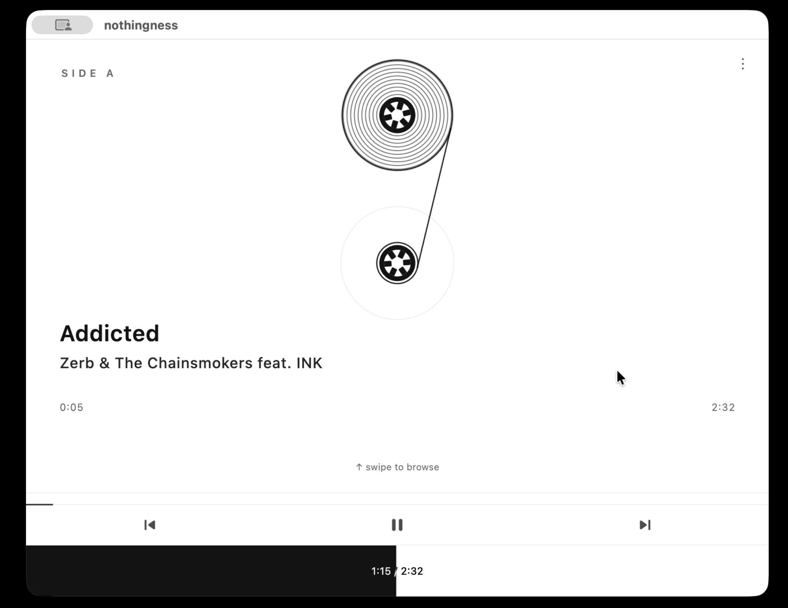

# Local & Small Models as Coding Agents — Field Test

Most "local LLM" tests are greenfield toy apps in Python/JS, scored on whether the "whater sim" or "flappy birds" looks right. This one inverts all of that:

- **Real, mutable codebase, not greenfield.** A live ~15k-LOC app the models had to *maintain* — read existing structure, fit conventions, and not break it (several did edit the wrong files).
- **Hard-for-AI language.** Dart/Flutter, far less represented in training data than Python/JS — capability has nowhere to hide.
- **End-to-end agentic, not code-gen-in-a-vacuum.** The model must drive the *running* macOS build, exercise it, and validate behavior at runtime — not just emit a diff.
- **Evidence required, scored on truth.** Every task demands a screenshot; scores come from my own manual verification, not the model's self-report — which is how the "declared success, screenshot disproves it" failures got caught.
- **Escalating difficulty** (smoke-drive → settings + validate → timed swipe-gesture repro) gives a capability gradient that cleanly separated cloud SOTA from local.
- **Mature harness.** Purpose-built app-driving tools + skills, so a model's failure reflects the model, not a missing scaffold.

## Environment

- **Hardware:** RTX 4090 (24GB), Core i5-13600K, 64GB RAM
- **Local runtime:** LM Studio 0.4.16 (b2) · llama.cpp CUDA 12 (Windows) v2.21.0
- **Hosted:** Google AI Studio (Gemma) · Azure (GPT)
- **Agent harness:** pi coding agent (except gpt-5.3-codex--medium, run via GitHub Copilot)
- **Target:** live [Flutter app, ~15k LOC Dart](https://github.com/maxim-saplin/nothingness) — drive the real macOS build, validate at runtime, produce screenshot evidence, keep tests green
- **Method:** single run per cell (qualitative field test, not a benchmark); manual verification of every result; human nudges allowed and noted

## Tasks

| Task | What it asks | Difficulty |
|---|---|---|
| **T1 — Drive** | Drive macOS app; smoke test play/pause, skip, fast-forward | low |
| **T2 — Settings** | Show *variants* under *cassette*; validate live + screenshot. Variation: rename *variant*→*color scheme* | medium |
| **T3 — Swipe-seek** | Replace centered seek overlay with bottom line + progress bar; validate live + screenshot | high |

## Results

Score 0–3 (FAIL / BAD / AVG / GOOD) · `(s)` skill-prompted · `2→3(s)` plain then skill · `—` not run · `DNF` infra failure · `✅` clean pass

| # | Model (host) | T1 · T2 · T3 | Comment |
|---|---|---|---|
| 1 | **gpt-5.3-codex--medium** (cloud) | — · — · ✅ | Reference, run via GitHub Copilot. Only model to nail the hardest task cleanly; even improved the harness to do it. T3 only. |
| 2 | **gpt-5.4-mini-medium** (cloud) | 3 · 3 · DNF | Broadest clean record; 3s wherever it ran. Lost T3 to Azure throttling, not capability. |
| 3 | **qwen3.6-35b-a3b q4** (local) | 2 · 2→3(s) · 1 | The step-change. Best local; only SLM to finish Settings well. 24GB @ ~100 tok/s, full 256k ctx. Needs nudging; T3 shipped but buggy. |
| 4 | **gemma-4-31b-it** (Google API) | 3 · 2(s) · 0 | Best Gemma. Clean T1; failed T3 ×3. Leans on skill + nudges. Occasional server glitches (`MALFORMED_RESPONSE`, 500s). |
| 5 | **gemma-4-26b-a4b-it** (Google API) | 1 · 0(s) · — | Launches apps but loops, invents bugs, edits random files; no evidence produced. Occasional 500s. |
| 6 | **gemma-4-12b-qat q4** (local) | 1(s) · — · — | Hard-crashes mid-run (matches chess/arithmetic benches). Partial smoke test at best. |
| 7 | **gemma-4-26b-a4b-qat q4** (local) | 0 · 0(s) · — | Failed all incl. hard crash; huge token burn (1.5M+ in). Worst despite fitting fully in VRAM. |

**Tiers:** cloud SOTA (1–2) → viable local (3, Qwen) → hosted Gemma, glitchy but usable (4–5) → local Gemma, hard-crashes (6–7).

## Token economics (pi session counters)

Legend: **↑** input · **↓** output · **R** reasoning · **CH** cache-hit · **Peak** high-water context fill (window: 262k local/Google, 400k GPT) · `·s` skill-prompted. All sessions ran with auto-compaction on.

| Task | Model · run (score) | ↑ in | ↓ out | R | CH | Peak |
|---|---|--:|--:|--:|--:|--:|
| T1 | gpt-5.4-mini (3) | 86k | 2.6k | 542k | 85.9% | 21% |
| T1 | qwen3.6-35b (2) | 913k | 6.1k | — | — | 16% |
| T1 | gemma-4-26b-qat (0) | 1.5M | 18k | — | — | 28% |
| T1 | gemma-4-26b-qat ·s (0) | 668k | 6.8k | — | — | 17% |
| T1 | gemma-4-12b-qat (0) | 319k | 1.9k | — | — | 19% |
| T1 | gemma-4-12b-qat ·s (1) | 478k | 6.4k | — | — | 18% |
| T1 | gemma-4-26b-it (1) | 721k | 53k | 5.0M | 0.0% | 57% |
| T1 | gemma-4-31b-it (3) | 301k | 9.5k | 817k | 80.0% | 33% |
| T2 | gpt-5.4-mini (3) | 176k | 12k | 1.6M | 99.5% | 19% |
| T2 | qwen3.6-35b (2) | 1.9M | 9.8k | — | — | 26% |
| T2 | qwen3.6-35b ·s (3) | 698k | 4.2k | — | — | 14% |
| T2 | gemma-4-26b-it ·s (0) | 943k | 40k | 7.6M | 0.0% | 58% |
| T2 | gemma-4-31b-it ·s (2) | 168k | 6.7k | 440k | 98.2% | 14% |
| T3 | qwen3.6-35b · attempt 1 (1) | 2.3M | 11k | — | — | 27% |
| T3 | qwen3.6-35b · attempt 2 (1) | 9.4M | 32k | — | — | 42% |
| T3 | gemma-4-31b-it · try 1 (0) | 587k | 19k | 2.3M | 93.3% | 36% |
| T3 | gemma-4-31b-it · try 2 (0) | 882k | 25k | 3.1M | 66.7% | 51% |
| T3 | gemma-4-31b-it · try 3 (0) | 1.3M | 30k | 3.9M | 93.7% | 59% |

**Cost ($) reported only for GPT:** $0.117 (T1), $0.302 (T2). Local models are free; Google-hosted Gemma ran on free tier — so dollars aren't comparable, and the honest cost axis is tokens + wall-clock.

Patterns:

- **Input dwarfs output, 30–300×.** The work product (↓) is tiny and stable (1.9k–53k) regardless of success; nearly all token volume is context replayed each agentic turn. Qwen's looping T3 run hit ↑9.4M for just 32k out (≈294×) — the single biggest session in the test.
- **Reasoning blow-up tracks failure.** R explodes on the loop/FAIL runs: gemma-26b-it R7.6M (T2 FAIL) and R5.0M (T1 BAD), both at CH0.0%; gemma-31b climbed R2.3M→3.1M→3.9M across its three failed T3 retries.
- **Cache-hit is the hidden cost lever — and erratic on hosted Gemma.** GPT held 85.9–99.5%; gemma-31b swung 66.7–98.2%; gemma-26b sat at 0.0% twice (no caching → every turn fully reprocessed, compounding the reasoning blow-up).
- **Local counters omit R and CH entirely.** LM Studio sessions report neither, so Qwen's "thinking" is invisible here and cross-stack reasoning numbers aren't apples-to-apples.
- **Local burns 10–30× the raw input of GPT for equal-or-worse outcomes** — but at $0. GPT got GOOD on T1 with ↑86k; Qwen got AVG with ↑913k (≈11×). The local penalty is latency/wall-clock, not money.
- **Peak context stayed moderate (14–59%) even as cumulative ↑ hit millions** — auto-compaction kept any single window small, so the millions are many replay-heavy turns, not one giant prompt.

## Takeaways

- **Qwen3.6-35B-A3B is genuinely usable** for hands-on coding on a 24GB consumer GPU — a real shift from "local = toy." Needs nudging, so not for long-horizon autonomy.
- **Runtime stack matters as much as the weights:** local llama.cpp Gemma *hard-crashed*; the same family on Google's API only *glitched* (recoverable). Neither was crash-free.
- **SLM failure mode:** disproportionately hard requests trigger 10k+ token reasoning loops (reproduced across chess/arithmetic benches).
- **Self-reports are unreliable** — models declared success while their own screenshots disproved it (T3).
- **Small models are capable but jagged:** lots of human-in-the-loop. Useful for hands-on work, not autonomous swarms.
